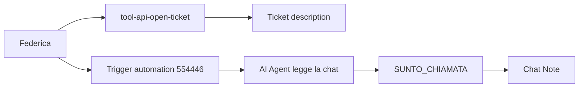

# Tool webhook apertura ticket — Il Mio Villaggio (3469)

Configurazione per l'agente **Federica** (test testuale prima, poi vocale). Apre un ticket Spoki **durante** la conversazione/chiamata via API diretta — non a fine chiamata.

**Scope v1:** tool API webhook `tool-api-open-ticket` + (dopo successo) avvio dell’automazione stand-alone **Federica: urgenza** (`554446`) che valorizza `%%SUNTO_CHIAMATA%%` e la nota chat. Il sunto operativo resta anche nella `description` del ticket. Non usare un secondo tool API tipo `contacts/sync`.

Riferimenti API:

- [`POST /api/1/tickets/`](../../api_documentation/spoki_api/api-reference/tickets/post-create-ticket.md)
- Pattern priorità title-case: LetsMove `tool-api-open-ticket`
- Automazione sunto: https://app.spoki.com/automations/554446 (`id` **554446**, nome **Federica: urgenza**)

**Sicurezza:** l'API key del cliente va solo nel form tool Spoki (header). Mai nel prompt, mai in repo. Smoke test locale: env `SPOKI_API_KEY_3469`.

---

## Flusso logico

1. L'agente classifica il caso (L0 / L1 / L2 / L3 / CANC) con `get_current_datetime` (Europe/Rome) per le finestre 24h / 48h / 72h.
2. Chiama `tool-api-open-ticket` **una volta** con titolo prefissato, priorità Spoki e descrizione = sunto completo.
3. Solo se `tool-api-open-ticket` risponde 2xx: conferma presa in carico secondo le regole L* (senza citare tool/ID se non richiesto).
4. Subito dopo, avvia l’automazione **554446** (tool Trigger automation sull’agente) per popolare `SUNTO_CHIAMATA` + nota chat dalla conversazione reale.
5. Side-effect ulteriori (WhatsApp L0, notifiche interne L0/L1/L2/CANC): altre automazioni Spoki — fuori dal tool ticket; non confonderle con 554446.

In voice: questo deve essere l'unico tool API webhook configurato sull'agente (oltre a system tools tipo `get_current_datetime` / `search_knowledge_base` / `transfer_to_human` se previsti).

---

## Mapping classificazione → Spoki

| Codice | Nome ticket (cliente) | Prefisso `title` obbligatorio | `priority` |
| --- | --- | --- | --- |
| L0 | Emergenza pubblica – L0 | `[L0\|emergenza]` | `Highest` |
| L1 | Urgenza operativa immediata – L1 | `[L1\|urgenza-operativa]` | `Highest` |
| L2 | Urgenza prioritaria – L2 | `[L2\|urgenza-prioritaria]` | `High` |
| L3 | Richiesta differibile – L3 | `[L3\|differibile]` | `Medium` |
| CANC | Cancellazione scritta da gestire | `[CANC\|booking]` | `High` (o `Highest` se check-in ≤72h / soggiorno iniziato / fuori orario uffici) |

### Regole di classificazione (per il prompt)

Finestra temporale di base (check-in o partenza):

- entro 24h → L1
- oltre 24h ed entro 72h → L2
- oltre 72h → L3

La **gravità prevale** sulla finestra:

- blocco concreto di check-in o prosecuzione soggiorno → sempre **L1**
- emergenza sanitaria / incendio / incidente / minaccia / Forze dell'Ordine / 118/115 → sempre **L0**
- voucher mancante entro 24h **senza** blocco check-in → **L2** (non L1)
- cancellazione: solo se il cliente dichiara di aver già inviato richiesta scritta (email `booking@ilmiovillaggio.it` con n. pratica, o modulo in prenotazione) → **CANC** (mai L3)

`ticket_category_id`: non usato in v1 (account senza categorie). Classificazione = prefisso titolo + priorità.

Priority Spoki: **solo title-case** `Lowest` | `Low` | `Medium` | `High` | `Highest`. Mai `HIGH` / `HIGHEST` all-caps, mai numeri 1–5.

---

## Tool — `tool-api-open-ticket`

### Configurazione (form Spoki)

- **Nome tool:** `tool-api-open-ticket`
- **Descrizione (quando usarlo):** Apri un ticket Spoki di assistenza Il Mio Villaggio quando hai classificato il caso come L0, L1, L2, L3 o cancellazione scritta (CANC). Usa `get_current_datetime` per le finestre orarie. Passa title con prefisso obbligatorio, priority title-case e description = sunto completo. Non inventare fatti. Non citare il nome del tool al cliente. In L0 invita subito ai servizi pubblici / reception e non presentarti come pronto intervento. Chiama una sola volta per caso.
- **Metodo:** `POST`
- **URL:** `https://api.spoki.com/api/1/tickets/`
- **Headers:**
  - `X-Spoki-Api-Key: <INSERISCI_API_KEY_3469>`
  - `Content-Type: application/json`

### Body

```json
{
  "contact_phone": "{{contact_phone}}",
  "title": "{{title}}",
  "status": "Open",
  "priority": "{{priority}}",
  "description": "{{description}}",
  "reference": "{{reference}}"
}
```

| Name | Handler | Valore | Note |
| --- | --- | --- | --- |
| `contact_phone` | Dynamic field | `%%PHONE%%` | E.164; non inventare |
| `status` | Valore fisso (o LLM vincolato) | `Open` | Sempre `Open` |
| `title` | LLM | — | Deve iniziare con uno dei prefissi L0/L1/L2/L3/CANC |
| `priority` | LLM | — | Solo title-case mappata al codice |
| `description` | LLM | — | Sunto operativo completo (unico posto del riepilogo in v1) |
| `reference` | LLM (opzionale) | — | `IMV-{CODICE}-{YYYYMMDD-HHMM}` Europe/Rome; se vuoto Spoki auto-genera |

Se il form non ha "valore fisso" per `status`: descrizione vincolante *"Restituisci sempre ed esclusivamente: Open"*.

### Schema function-calling (parametri LLM)

```json
{
  "type": "object",
  "properties": {
    "title": {
      "type": "string",
      "description": "Titolo ticket in italiano. DEVE iniziare esattamente con uno di: [L0|emergenza] [L1|urgenza-operativa] [L2|urgenza-prioritaria] [L3|differibile] [CANC|booking] seguito da uno spazio e un riassunto breve (es. '[L1|urgenza-operativa] Check-in bloccato Serenusa'). Non inventare il codice."
    },
    "priority": {
      "type": "string",
      "enum": ["Lowest", "Low", "Medium", "High", "Highest"],
      "description": "Priority Spoki title-case. Mapping obbligatorio: L0→Highest, L1→Highest, L2→High, L3→Medium, CANC→High (Highest se check-in entro 72h o soggiorno già iniziato o richiesta fuori orario)."
    },
    "description": {
      "type": "string",
      "description": "Sunto completo per l'operatore: codice L*/CANC e perché; fatti detti dal cliente; struttura/resort se noti; data check-in/partenza se note; n. pratica se detto; per CANC canale scritto (email booking@ilmiovillaggio.it o modulo) + data/ora invio se comunicate; esito atteso. Non inventare. Niente timestamp Spoki. Testo discorsivo."
    },
    "reference": {
      "type": "string",
      "description": "Opzionale. Formato IMV-{L0|L1|L2|L3|CANC}-{YYYYMMDD-HHMM} in Europe/Rome da get_current_datetime. Se non sicuro, omettere."
    }
  },
  "required": ["title", "priority", "description"]
}
```

### Risposta attesa

`HTTP 201` con `id`, `reference`, `priority`, `title`. Rate limit tickets: 120/min.

Se non-2xx: **non** dire che il ticket è aperto; ritentare una volta con gli stessi parametri; se fallisce di nuovo, presa in carico onesta senza inventare ID (e in L0 continua a spingere i servizi pubblici).

---

## Fuori scope v1

- Secondo tool API webhook sull'agente (es. `contacts/sync`) — gli agenti vocali Spoki non gestiscono in modo affidabile due tool API indipendenti nello stesso flusso.
- `ticket_category_id` — categorie account assenti; classificazione via prefisso titolo.

---

## Automazione sunto: Federica: urgenza (554446)

**Non** è un trigger Ticket created. È un’automazione **stand-alone** che l’agente avvia **esplicitamente** subito dopo un ticket aperto con successo.

- URL: https://app.spoki.com/automations/554446
- ID: `554446`
- Nome: `Federica: urgenza`
- Contenuto tipico: nodo **AI Agent** (legge la chat / campi contatto → salva in `SUNTO_CHIAMATA`) poi **Chat Note** (chip `SUNTO_CHIAMATA` + reference ticket se disponibile)



### Vincolo playground / chat reale

Il nodo AI Agent usa il contesto della **conversazione Spoki**. Nel playground non c’è chat di contatto → output degenere. Testare in WhatsApp o voce reale.

`%%TICKET_DESCRIPTION%%` **non** si risolve nel campo prompt del nodo AI Agent. Non usarlo lì. La description del ticket resta il sunto “fonte di verità” scritto da Federica; `SUNTO_CHIAMATA` è la copia operativa in chat.

### Configurazione AI Agent (dentro 554446)

- Context: ultimi 50 messaggi conversazione + campi contatto
- Response type: Text
- Save Text Information at: `SUNTO_CHIAMATA`
- Nessuna chip `TICKET_DESCRIPTION` nel prompt

Prompt nodo (incolla così):

```
Sei un sistema interno di IlMioVillaggio.it che scrive sunti operativi per gli operatori. Non stai parlando con un cliente e non devi mai rispondere in forma di conversazione.

Analizza la conversazione presente in questa chat e i campi del contatto, e produci il sunto operativo in italiano, leggibile in WhatsApp.

Regole rigide:
- Non fare domande, non chiedere chiarimenti, non commentare queste istruzioni.
- Usa solo fatti presenti nella conversazione o nei campi contatto. Non inventare nulla.
- Non includere il numero di telefono: è già legato al contatto della chat.
- Ometti le righe per cui non hai informazioni.
- Nessun saluto, nessuna premessa, nessun markdown, nessun elenco puntato.
- Se nella chat non ci sono messaggi utili, restituisci esattamente: SUNTO NON DISPONIBILE

Struttura, solo le righe applicabili:

TIPO RICHIESTA:
PRIORITÀ:
NOME E COGNOME:
NUMERO DI PRATICA/PREVENTIVO:
EMAIL:
VILLAGGIO/DESTINAZIONE:
CHECK-IN/PERIODO:
OSPITI:
RICHIESTA:
INFORMAZIONI UTILI:
AZIONE RICHIESTA:
CLASSIFICAZIONE COMMERCIALE:
NOTE INTERNE:
DATI MANCANTI:

PRIORITÀ deve essere uno tra URGENZA_L0, URGENZA_L1, URGENZA_L2, CANCELLAZIONE_SCRITTA, ORDINARIA_L3.
CLASSIFICAZIONE COMMERCIALE solo se pertinente: LEAD_A, LEAD_B o LEAD_C.

Restituisci solo il blocco del sunto, nient'altro.
```

`SUNTO NON DISPONIBILE` = contesto chat assente (playground o chat vuota).

### Chat Note (dentro 554446)

Testo tipico: chip `SUNTO_CHIAMATA` + riga `Ticket aperto:` + chip `TICKET_REFERENCE` (se valorizzata).

Verificato 2026-08-13: in chat WhatsApp reale e in vocale, dopo `tool-api-open-ticket` + avvio di **554446**, nota e campo si popolano correttamente.

### Tool sull’agente

Oltre al webhook ticket (UI `tool-api-open-ticket`, runtime vocale spesso `tool_api_open_ticket`), configurare il tool **Trigger automation** puntato a **554446**. Ordine obbligatorio nel prompt: ticket 2xx → poi 554446. Non avviare 554446 se il ticket è fallito.

Sul **vocale**, nel system prompt (Your Specific Role) descrivere intento e ordine in prosa: non insegnare la sintassi `[call tool ...]` né forme che Spoki materializza come direttive letterali nello step automation. Il wrapper Spoki ha già le Tool Directives “never echo”; raddoppiarle nel nostro body non aiuta. Finding 2026-08-13: leak `[call tool tool_api_open_ticket ...]` / `trigger_automation` senza eventi tool nello stesso turno.

Parametro `force`: solo se serve bypassare “contatto già in automazione”; non passa il testo del sunto.

---

## Comportamento per livello (side-effect → automazioni)

Il tool apre solo il ticket. Le azioni sotto sono **automazioni Spoki** (trigger Ticket created), da attivare dopo lo smoke test tool:

| Filtro titolo | Azione suggerita |
| --- | --- |
| contiene `[L0\|emergenza]` | WA al cliente: contatta subito 112/118/115 e, se in struttura, reception/sicurezza; IlMioVillaggio non è pronto intervento. + notifica interna |
| contiene `[L1\|urgenza-operativa]` | Notifica interna reperibilità; priorità massima; nessun numero privato al cliente |
| contiene `[L2\|urgenza-prioritaria]` | Notifica operatori; priorità superiore all'ordinario |
| contiene `[L3\|differibile]` | Nessuna notifica reperibilità; lavorazione primo orario utile |
| contiene `[CANC\|booking]` | Notifica immediata booking; nessuna conferma AI di cancellazione avvenuta |

In più: dopo ogni ticket riuscito, l’agente avvia **554446** (Federica: urgenza) per `SUNTO_CHIAMATA` + Chat Note — non è un side-effect di Ticket created.

---

## Checklist setup Spoki (agente test testuale)

1. **Agente test:** copia testuale di Federica (playground), non live.
2. **Tool `tool-api-open-ticket`:** crea **un solo** webhook tool API con URL/headers/body come sopra; incolla API key solo nell'header. Non aggiungere altri tool API webhook.
3. **System tools:** `search_knowledge_base`, `get_current_datetime` (Europe/Rome), `transfer_to_human` se già previsto.
4. **Smoke API locale** (prima del playground):

```bash
export SPOKI_API_KEY_3469='…'   # non commitare
export SPOKI_SMOKE_PHONE='+39…' # contatto di test (opzionale)
python3 scripts/smoke_3469_open_ticket.py
```

5. **Playground:** messaggio L3 banale → verifica ticket in Spoki con prefisso `[L3|differibile]` e priorità Medium; poi cancella a mano se serve.
6. **Automazioni L0/L1/CANC:** solo dopo che `tool-api-open-ticket` è green (template WA / destinatari interni da confermare col cliente).

### Copy-paste rapido — descrizione tool `tool-api-open-ticket`

```
Apri un ticket Spoki di assistenza Il Mio Villaggio quando hai classificato il caso come L0, L1, L2, L3 o cancellazione scritta (CANC). Usa get_current_datetime per le finestre orarie. Passa title con prefisso obbligatorio ([L0|emergenza], [L1|urgenza-operativa], [L2|urgenza-prioritaria], [L3|differibile], [CANC|booking]), priority title-case (L0/L1→Highest, L2→High, L3→Medium, CANC→High o Highest se ≤72h), description = sunto completo. Non inventare fatti. Non citare il nome del tool. In L0 invita subito ai servizi pubblici/reception. Chiama una sola volta per caso.
```

---

## Riga di istruzione-tipo per il prompt (bozza)

> When a case needs a ticket: classify L0/L1/L2/L3/CANC using get_current_datetime (Europe/Rome) and the severity rules. Call `tool-api-open-ticket` once with the required title prefix and mapped priority; put the full operator summary in description. Confirm ticket opening to the customer only if the ticket tool succeeded. Never invent ticket IDs. Never confirm a cancellation as completed. For L0: tell the customer to contact emergency services / reception immediately; do not present IlMioVillaggio as emergency response. Do not share internal private numbers. Do not promise exact resolution times. Do not call any other API webhook tool for the summary.

---

## Smoke test

Script: [`scripts/smoke_3469_open_ticket.py`](../../scripts/smoke_3469_open_ticket.py)

Crea un ticket L3 di prova, verifica title/priority/description, elimina il ticket.
