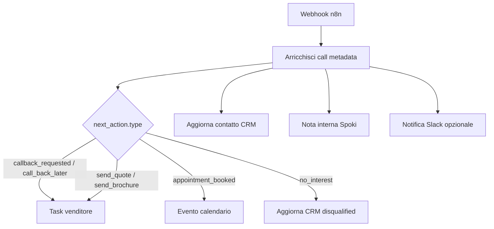

# Mapping payload webhook → CRM / task / calendario venditore

Riferimento per il workflow n8n collegato al tool [`voice-outbound-sales-webhook-tool.md`](voice-outbound-sales-webhook-tool.md).

Schema payload: [`../outbound-sales-agent/webhook-payload.schema.json`](../outbound-sales-agent/webhook-payload.schema.json)  
Config verticali: [`../outbound-sales-agent/vertical-config.json`](../outbound-sales-agent/vertical-config.json)

---

## Flusso destinazioni



---

## HubSpot

### Contatto — upsert properties

| Campo payload | HubSpot property | Note |
| --- | --- | --- |
| `contact.phone` | `phone` | Chiave di lookup primaria |
| `contact.email` | `email` | Lookup secondaria se presente |
| `contact.first_name` | `firstname` | |
| `contact.last_name` | `lastname` | |
| `contact.company_name` | `company` | |
| `contact.crm_contact_id` | `hs_object_id` | Se già noto, usa PATCH invece di search |
| `qualification.status` | `lead_qualification_status` | Custom property |
| `qualification.interest_level` | `interest_level` | Custom: hot / warm / cold |
| `qualification.need` | `pain_point` | Custom text |
| `qualification.timeline` | `purchase_timeline` | Custom |
| `qualification.budget_range` | `budget_range` | Custom |
| `qualification.objections` | `objections` | Custom multi-line (join con `; `) |
| `next_action.type` | `next_action_type` | Custom |
| `next_action.preferred_datetime` | `preferred_callback_datetime` | Custom datetime |
| `summary` | `ai_call_summary` | Custom long text |
| `call.conversation_id` | `elevenlabs_call_id` | Già usato in churn workflow |
| `call.outcome` | `last_call_outcome` | Custom |
| `call.attempt` | `ai_recall_attempt` | Pattern da cs-hub-churn |

### Automotive (`product_context`)

| Campo payload | HubSpot property |
| --- | --- |
| `product_context.marca` | `vehicle_brand` |
| `product_context.modello` | `vehicle_model` |
| `product_context.regione` | `region` |
| `product_context.trade_in` | `trade_in_details` |
| `product_context.vehicle_condition` | `vehicle_condition` |

### Chiamata — activity log

Pattern da [`cs-hub-churn-start-call.ts`](../../n8n-workflows/cs-hub-churn-start-call.ts):

```json
{
  "properties": {
    "hs_timestamp": "{{ $json.timestamp }}",
    "hs_call_title": "AI Outbound Sales Call",
    "hs_call_duration": "{{ $json.call.duration_seconds }}",
    "hs_call_from_number": "{{ $env.OUTBOUND_CALLER_ID }}",
    "hs_call_to_number": "{{ $json.contact.phone }}",
    "hs_activity_type": "AI Agent Call Sales",
    "hs_call_body": "{{ $json.summary }}",
    "hs_call_direction": "OUTBOUND",
    "elevenlabs_call_id": "{{ $json.call.conversation_id }}"
  }
}
```

### Task venditore

Creare task quando `next_action.type` è `callback_requested`, `call_back_later`, `send_quote` o `send_brochure`:

```json
{
  "properties": {
    "hs_task_subject": "Ricontatto lead: {{ $json.contact.first_name }} — {{ $json.qualification.interest_level }}",
    "hs_task_body": "{{ $json.summary }}\n\nProssima azione: {{ $json.next_action.type }}\nPreferenza oraria: {{ $json.next_action.preferred_datetime || 'non specificata' }}",
    "hs_task_status": "NOT_STARTED",
    "hs_task_priority": "{{ $json.qualification.interest_level === 'hot' ? 'HIGH' : 'MEDIUM' }}",
    "hs_timestamp": "{{ $json.next_action.preferred_datetime || $json.timestamp }}",
    "hubspot_owner_id": "{{ $json.contact.assigned_rep_id || $json.next_action.assigned_rep_id }}"
  },
  "associations": [
    {
      "to": { "id": "{{ $json.contact.crm_contact_id }}" },
      "types": [{ "associationCategory": "HUBSPOT_DEFINED", "associationTypeId": 204 }]
    }
  ]
}
```

### Meeting / calendario

Quando `next_action.type` = `appointment_booked` e `next_action.appointment_datetime` è valorizzato:

- Crea meeting HubSpot oppure evento Google Calendar del venditore
- `hs_meeting_title`: `Appuntamento — {{ contact.first_name }} {{ contact.last_name }}`
- `hs_meeting_body`: `summary` + campi `qualification` e `product_context`
- `hs_meeting_start_time` / `hs_meeting_end_time`: da `appointment_datetime` (+30 min default)

Se l'agente usa `sales-rep-calendar-booking` in chiamata, il meeting è già creato: il webhook serve solo a sincronizzare il CRM con `crm_contact_id` e `summary`.

---

## Spoki

### Nota interna in chat

Dopo upsert CRM, scrivi nota per l'operatore (pattern [`add-note-webhook-tool.md`](add-note-webhook-tool.md)):

```
POST https://api.spoki.com/api/1/messages/send/
{
  "type": "Note",
  "content_type": "Text",
  "phone": "{{ contact.phone }}",
  "text": "Chiamata outbound AI completata\nStato: {{ qualification.status }} ({{ qualification.interest_level }})\nProssima azione: {{ next_action.type }}\n\n{{ summary }}"
}
```

### Aggiornamento campi contatto

Mappa i campi raccolti sui custom field Spoki del cliente:

| Payload | Spoki custom field |
| --- | --- |
| `contact.first_name` | `FIRST_NAME` |
| `contact.last_name` | `LAST_NAME` |
| `contact.email` | `EMAIL` |
| `product_context.marca` | `MARCA` |
| `product_context.modello` | `MODELLO` |
| `product_context.regione` | `REGIONE` |
| `qualification.need` | `NEED` |
| `qualification.timeline` | `TIMELINE` |
| `next_action.type` | `NEXT_ACTION` |

Endpoint: `PATCH /api/1/contacts/{id}/` oppure automazione Spoki post-webhook.

### Handoff umano

Se `call.transferred_to_human` = true, riusa [`transfer-human-webhook-tool.md`](transfer-human-webhook-tool.md) con `summary` già nel payload.

---

## Google Sheets (fallback / MVP)

Per prototipi senza CRM:

| Colonna | Campo |
| --- | --- |
| A | `timestamp` |
| B | `contact.phone` |
| C | `contact.first_name` |
| D | `contact.email` |
| E | `qualification.status` |
| F | `qualification.interest_level` |
| G | `next_action.type` |
| H | `summary` |
| I | `vertical` |

n8n: nodo **Google Sheets → Append Row**.

---

## Routing venditore

Priorità assegnazione `hubspot_owner_id` / `assigned_rep_id`:

1. `contact.assigned_rep_id` — pre-popolato dalla lista outbound
2. `next_action.assigned_rep_id` — override esplicito
3. Regola n8n per `product_context.regione` o `location.region` → owner territoriale
4. Round-robin sul pool venditori attivi

---

## Logica condizionale n8n (switch)

| Condizione | Azione |
| --- | --- |
| `qualification.status` = `not_qualified` | Aggiorna CRM, nessun task, lifecycle → nurture o disqualified |
| `next_action.type` = `no_interest` | Aggiorna CRM, flag `do_not_call` se consentito |
| `next_action.type` = `appointment_booked` | Meeting + nota Spoki |
| `qualification.interest_level` = `hot` | Task HIGH + notifica Slack immediata |
| `call.outcome` ≠ `answered` | Solo log tentativo, incrementa `ai_recall_attempt` |

---

## Esempio payload completo

Vedi [`webhook-payload.example.json`](../outbound-sales-agent/webhook-payload.example.json).
