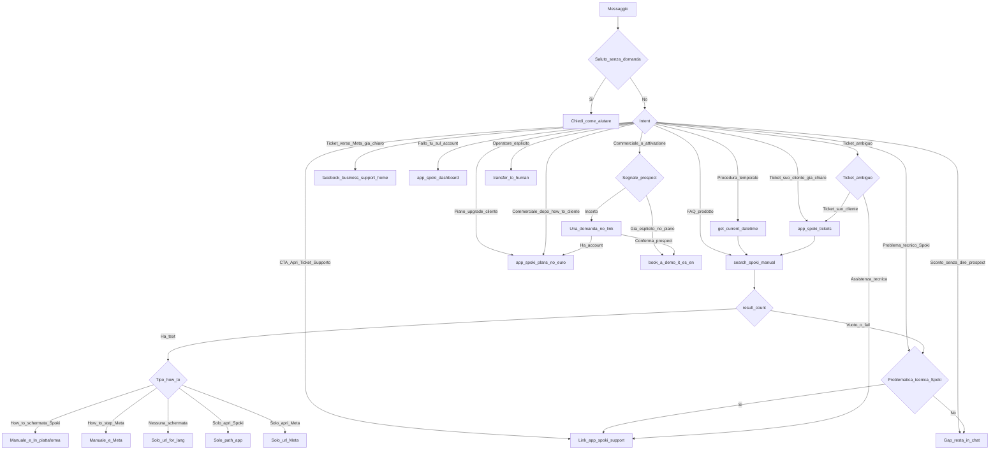

# 1384 — Mario AI Operator — runtime flow (internal)

Solid = already in the prompt (cite the section). `da_scrivere` = advised, not written yet.

- Solid: Ruolo, Obiettivo, Lingua, Tools, Flusso (CTA ticket → support; commerciale dopo how-to → /plans), Disambiguazione ticket, Assistenza, Ticket, allowlist, Prospect, Limiti (no nessi metriche inventati), Tono, Esempi
- Nessun `da_scrivere`
- Mai tre URL; mai `In piattaforma:` + `Meta:`; mai support o how-to + book-a-demo
