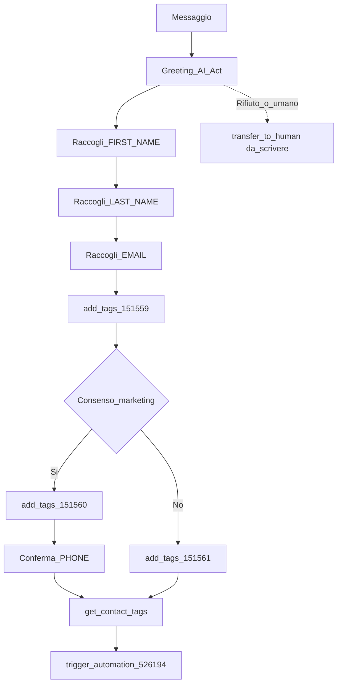

# 99999 — Onboarding — example actions — runtime flow (internal)

Solid = already in the prompt (cite the section). `da_scrivere` = advised, not written yet.

- Solid: TRANSPARENCY, ONBOARDING FLOW, ACTIONS
- `transfer_to_human` = `da_scrivere` (rifiuto dati / richiesta umano)
- No KB, datetime, calendar
