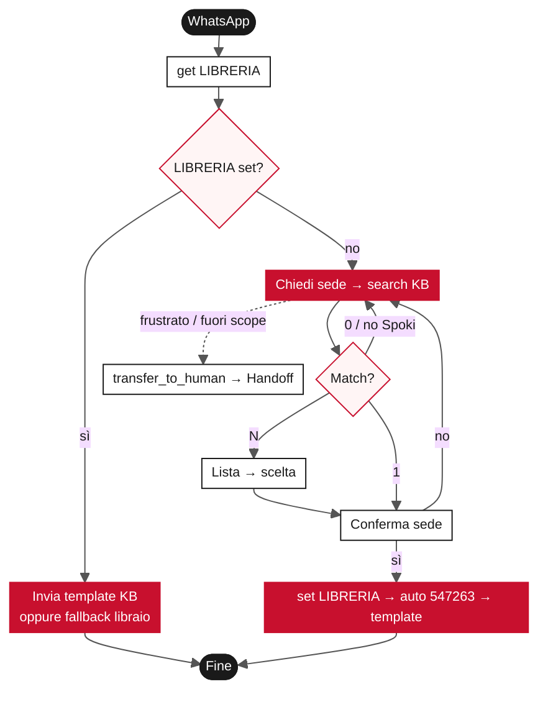

```mermaid page=portrait title="Feltrinelli FINAL · 21554 · v1"
%%{init: {
  "flowchart": {
    "curve": "basis",
    "padding": 4,
    "nodeSpacing": 10,
    "rankSpacing": 18,
    "htmlLabels": true
  },
  "theme": "base",
  "themeVariables": {
    "fontFamily": "Helvetica, Arial, sans-serif",
    "fontSize": "11px",
    "primaryTextColor": "#1a1a1a",
    "lineColor": "#555555"
  }
}}%%
flowchart TB
  A([WhatsApp]) --> B["get LIBRERIA"]
  B --> C{LIBRERIA set?}

  %% --- già registrato ---
  C -->|sì| R1["Invia template KB<br/>oppure fallback libraio"]
  R1 --> Z([Fine])

  %% --- nuovo ---
  C -->|no| N1["Chiedi sede → search KB"]
  N1 --> N2{Match?}
  N2 -->|0 / no Spoki| N1
  N2 -->|N| N3["Lista → scelta"]
  N3 --> N4["Conferma sede"]
  N2 -->|1| N4
  N4 -->|no| N1
  N4 -->|sì| N5["set LIBRERIA → auto 547263 → template"]
  N5 --> Z

  N1 -.->|frustrato / fuori scope| X["transfer_to_human → Handoff"]

  classDef terminal fill:#1a1a1a,stroke:#1a1a1a,color:#fff
  classDef box fill:#fff,stroke:#1a1a1a,color:#1a1a1a
  classDef ask fill:#fff5f5,stroke:#c8102e,color:#1a1a1a
  classDef go fill:#c8102e,stroke:#c8102e,color:#fff

  class A,Z terminal
  class B,N3,N4,X box
  class C,N2 ask
  class N1,N5,R1 go
```
