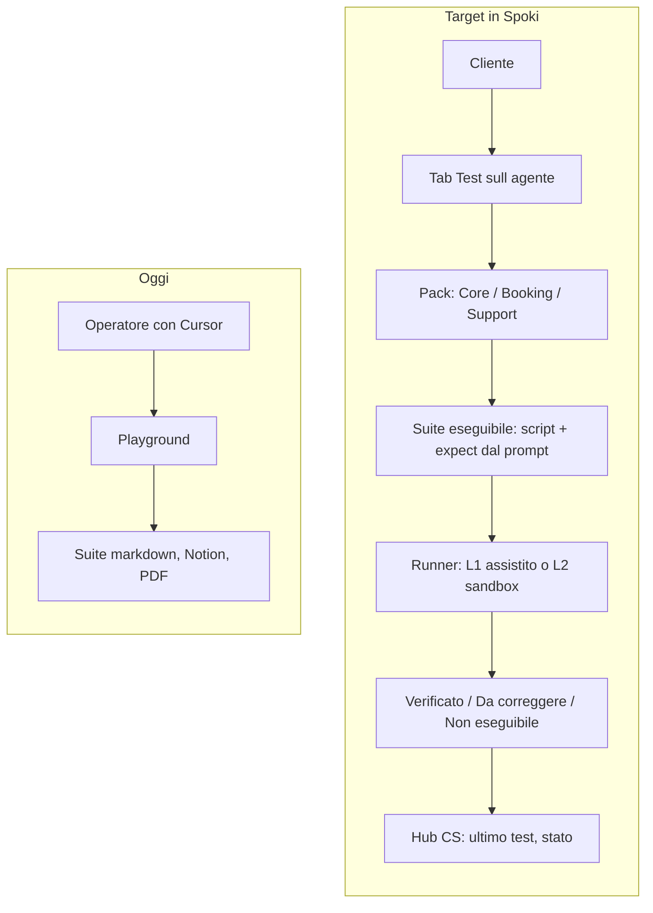
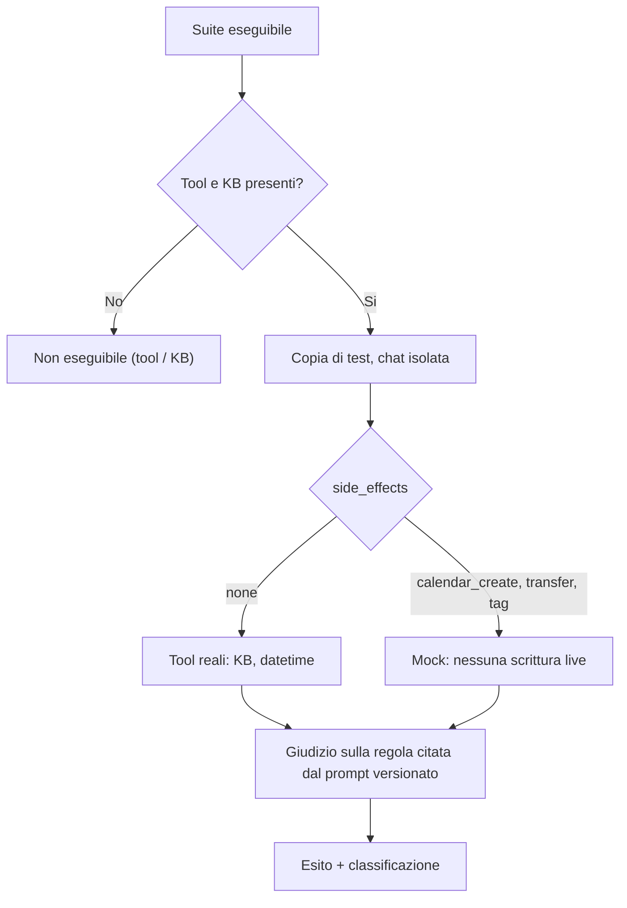

# Test agente in Spoki — handoff al team prodotto

**Da:** Post Sales / AI prompt testing
**Data:** 4 settembre 2026
**Oggetto:** rendere il testing degli agenti accessibile al cliente dentro Spoki
**Spec tecnica completa:** [product/spoki-agent-test.md](file:///Users/giulio/Desktop/AI-churn-analysis/.cursor/skills/spoki-prompt-test/product/spoki-agent-test.md)

---

## Il problema in una frase

Oggi solo un operatore con Cursor può validare un agente rispetto al suo system prompt. Serve un tab **Test** sulla pagina agente in Spoki, così il cliente (e il CS in impersonate) lancia scenari, vede esiti in italiano e sa cosa fare dopo — senza git, Notion o Langfuse.

## Perché ora

Ogni agente costa una sessione turno per turno: un messaggio, attesa, valutazione, aggiornamento del file. Sono state prodotte 17 suite in questo modo (Casp CUP, Mario AI Operator, LetsMove, Boldrin, Dreaming Sicily, Calatafimi, Dimann, AVS Ultra…). Il processo funziona ma non scala oltre l'operatore singolo, e il cliente non vede nulla in prodotto.

## Il contratto di qualità da non perdere

Sono le tre regole che rendono affidabile il testing manuale. Vanno replicate nel prodotto, altrimenti il tab Test genera falsi verdi e falsi allarmi.

| Regola | Conseguenza in UI |
| --- | --- |
| Si valuta **solo il prompt reale** dell'agente | Se una regola non è nel prompt, quello scenario non compare e non può fallire |
| Manca un tool o la knowledge base → **non eseguibile**, non "da correggere" | Lo skip è visibile e classificato (tool / KB / piattaforma) |
| Scenari con effetti collaterali non toccano la produzione | Creazione appuntamento, tag contatto e transfer girano su copia di test con mock |

---

## Knowledge base: ingestione, non “carica qualsiasi file”

Ottimizzare la knowledge base è spesso ciò che sblocca i test FAQ, non un ritocco al prompt. Lo scrape di una o più URL e l’upload PDF **non** sono ingestion di qualità: arrivano pieni di menu, banner cookie e tag XML/layout, e l’assistente li può citare. I formati affidabili sono **testo strutturato** (si scrive in markdown; oggi Spoki accetta `.txt`, non `.md`) e **CSV** per le tabelle (listini, turni, cataloghi).

Default sull’agente: **un** file operativo di soli fatti (debug più semplice). Più file solo per i CSV o per il tetto caratteri della piattaforma, non “un PDF a pagina”. Scrape e PDF restano porta d’ingresso: si riscrivono, non si collegano così come sono.

Non chiedere a prodotto un pulitore XML/PDF nel primo tab Test. Chiedere: avviso in chiaro + guida a testo/CSV. Un flusso “ripulisci e unifica” è eventuale, dopo.

Copy cliente (schermata KB o prossimo passo del Test):

> Carica testi e tabelle puliti (file di testo o CSV). Lo scrape del sito e i PDF spesso includono menu e codice: l’assistente può citarli.

---

## Evidenza Langfuse — retrieval su PDF (AVS Ultra / Raptor)

Osservato in playground il 4 settembre 2026, agente testuale Alex AVS Assistant. Non è un’ipotesi: è l’I/O dello span `search_knowledge_base`. Il tool ha successo; la query è pertinente; i top-k sono testo estratto da PDF (copertine, schede, duplicati, tag). Non è un fail del prompt.

**Traccia (osservazione tool):** [Langfuse — search_knowledge_base](https://langfuse.ai.spoki.com/project/cmmxdg3y70004oa073ytjt9md/traces?search=7f207435-7842-4edb-906e-e03faa978d91&searchType=id&searchType=content&peek=7f76973faa67906849824f99553104fb&timestamp=2026-09-04T14%3A03%3A41.818Z&observation=deb970facee18ad5)

| Campo | Valore |
| --- | --- |
| Progetto | ai-production |
| Agent id | `7f207435-7842-4edb-906e-e03faa978d91` |
| Trace peek | `7f76973faa67906849824f99553104fb` |
| Observation | `deb970facee18ad5` |
| Tool | `search_knowledge_base` |
| Status | `success` |
| Tool call id | `ca47b30b-1a75-432c-a8ad-c9453a098831` |

**Input utente (WhatsApp / playground)**

Come posso gestire le temperature con centrale Raptor?

**Input tool (`query`)**

gestione temperature centrale RAPTOR software XWIN funzione termostato

Cosa leggere nei 10 chunk (testo integrale in appendice):

| # | source_id (prefisso) | Cosa è | Perché è rumore o fuorviante |
| --- | --- | --- | --- |
| 1 | `fd8fa10b-…` | Scheda Raptor (125 dispositivi, Xwin, volt) | Listing commerciale; chiude con `</DOCUMENT>` |
| 2 | `fd8fa10b-…` | Menù “Abil. sens. temp” (soglia, offset, isteresi) | Unico pezzo vicino al tema; è allarme del **sensore**, non la procedura termostato Economy/Comfort |
| 3 | `f3514c4c-…` | Copertina PDF Xwin | `I T A`, ISO9001, “Sommario” — layout di pagina |
| 4–7 | `b150222b-…` | Stesse schede ripetute (modelli diversi) | “Temperatura -10 / +55 °C” = range di **esercizio** della centrale, non gestione clima; duplicati |
| 8 | `fd8fa10b-…` | Ancora scheda Raptor (tastiere, zone, radio) | Stesso PDF, altro taglio |
| 9–10 | `f3514c4c-…` | Indice + installazione Xwin | Puntini da sommario PDF (`DESCRIZIONE ..... 3`), Windows 95, CD-ROM |

Tre conclusioni per sviluppo, senza accesso al resto del backend:

1. Lo span tool è il contratto I/O da catturare in L2 (query in, `content[].text` + `source_id` out).
2. Indicizzare il PDF così com’è fa collidere “temperatura” con il range ambientale e con il sommario Xwin.
3. La procedura pulita esiste già in un markdown di fatti (manuale Ultra, sezione termostato: Economy / Normal / Comfort). Se sull’agente restano i PDF, il modello vede il sommario, non quella sezione.

Cosa non è: un bug di `search_knowledge_base` (ha restituito i documenti collegati). È ingest.

---

## Cosa chiedere di costruire

### L1 — Tab Test accanto al playground (MVP UI)

Il cliente sceglie un pack, compila poche variabili, esegue e segna l'esito.

- Pack: **Core** per tutti; **Booking** se il prompt usa calendario; **Support** se è FAQ, ticket o manuale.
- Variabili: saluto, frase "parla con un operatore", nome fittizio, domanda coperta dalla knowledge base.
- Esiti in italiano: **Verificato** / **Da correggere** / **Non eseguibile**.
- Per ogni scenario: trascrizione, la regola del prompt in una frase, il prossimo passo ("aggiorna la knowledge base: testo o CSV puliti, un file di fatti", "collega il tool X", "il prompt contraddice il tool").
- Fuori dalla UI cliente: ID interni tipo `H1`, `Pass*`, percorsi Notion, Langfuse.

### L2 — Runner sandbox (qui sparisce il copia-incolla)

API che apre una conversazione isolata sulla **copia di test**, invia gli script, cattura risposta e chiamate tool, poi pulisce la conversazione.

- Tool con effetti collaterali in mock: `create_event` non scrive sul calendario, transfer e tag non toccano CRM e code umane.
- Se manca un tool dichiarato o la knowledge base: skip automatico, senza chiamare il modello.
- Il pack Booking in auto-play si abilita **solo dopo** il mock calendario.

### L3 — Giudizio automatico, regressione, webhook CS

- Il giudice riceve **solo** la regola citata dal prompt versionato con quella run. Nessun rubric globale Spoki (emoji, tu/Lei, markdown) se non è nel prompt del cliente.
- Re-run degli scenari P0 quando si salva il prompt o si ricarica la knowledge base. Badge "ultimo test" sull'agente, ambrato se prompt o KB sono più recenti dell'ultima run.
- Webhook interno verso l'hub CS: data ultimo test, stato, conteggi.
- Patch automatica del prompt live: no. Al massimo un suggerimento in bozza.

---

## Cosa non fare

- Un prodotto "Eval" separato al primo giro: è un tab sull'agente.
- Esecuzione live di scenari con creazione appuntamento o tag contatto.
- Fail su criteri assenti dal prompt del cliente.
- Chiedere al cliente di aprire Langfuse, Notion o il repo.
- Trattare scrape URL e PDF crudi come knowledge base “pronta”: sono rumore da riscrivere.
- Promettere in UI un cleaner automatico di XML/PDF nel MVP.

## Perché Langfuse resta fuori dalla UI cliente

Langfuse è lo strumento interno con cui si legge la traccia e il payload dei tool: login separata, progetti dedicati, a volte dati personali in chiaro. Il runner può e deve continuare a tracciare, ma il link non va nel tab Test: al cliente serve l'esito e il prossimo passo. Il CS vede in più run id, classificazione e link alla copia di test; engineering ha la traccia.

---

## Contratto dati (già pronto)

Suite eseguibile in JSON/YAML sull'agente, accanto alla suite leggibile. Campi principali:

- `script` — i turni utente da inviare
- `expect` — la regola citata dal prompt sotto test, più l'etichetta in italiano per il cliente
- `tools_required`, `kb_required`
- `side_effects` — `none`, `calendar_create`, `transfer`, `tag`
- `classify_on_fail` — `prompt`, `kb`, `tool`, `platform`
- `prompt.version_id` — versione del prompt usata per quella run

### Artefatti da consegnare a prodotto

| Cosa | Dove |
| --- | --- |
| Spec prodotto L1–L3 | [spoki-agent-test.md](file:///Users/giulio/Desktop/AI-churn-analysis/.cursor/skills/spoki-prompt-test/product/spoki-agent-test.md) |
| JSON Schema della suite | [agent-test-suite.schema.json](file:///Users/giulio/Desktop/AI-churn-analysis/.cursor/skills/spoki-prompt-test/schema/agent-test-suite.schema.json) |
| Pack Core | [core.yaml](file:///Users/giulio/Desktop/AI-churn-analysis/.cursor/skills/spoki-prompt-test/packs/core.yaml) |
| Pack Booking | [booking.yaml](file:///Users/giulio/Desktop/AI-churn-analysis/.cursor/skills/spoki-prompt-test/packs/booking.yaml) |
| Pack Support | [support.yaml](file:///Users/giulio/Desktop/AI-churn-analysis/.cursor/skills/spoki-prompt-test/packs/support.yaml) |
| Esempio Core + Booking (Casp 53298) | [53298-centro-unico-prenotazioni-suite.yaml](file:///Users/giulio/Desktop/AI-churn-analysis/clients-prompt/53298-centro-unico-prenotazioni-suite.yaml) |
| Esempio Core + Support (Mario 1384) | [1384-mario-ai-operator-suite.yaml](file:///Users/giulio/Desktop/AI-churn-analysis/clients-prompt/1384-mario-ai-operator-suite.yaml) |
| Processo interno attuale (skill) | [SKILL.md](file:///Users/giulio/Desktop/AI-churn-analysis/.cursor/skills/spoki-prompt-test/SKILL.md) |

### Riferimenti Notion

- [Agenti testuali e vocali clienti](https://app.notion.com/p/3b9e5c7af25c80fd8705f8561a2eed09) — hub con righe agente, documenti e changelog
- [Playbook — AI prompt testing](https://app.notion.com/p/3c0e5c7af25c8146909cd57cc9e5bd8c) — come il team esegue una suite oggi
- [Install — Spoki prompt test (Cursor)](https://app.notion.com/p/3c0e5c7af25c816bb377d37ef43c177e) — pagina install sotto l'hub agenti
- [Install — Spoki prompt test (Post Sales)](https://app.notion.com/p/3cfe5c7af25c81ceacacc5a4ec9fe8c8) — pagina gemella, stessi allegati

---

## Pilot suggerito

Tre agenti, prima dell'automazione, per validare copy ed esiti:

1. un CUP su copia di test (Core + Booking, con mock calendario);
2. un agente di supporto tipo Mario (Core + Support);
3. un caso FAQ senza calendario, tipo LetsMove (Core + Support).

## Frase per lo standup

Tab Test sull'agente, stesso contratto di qualità del prompt testing interno: P0 prima di tutto, nessuna regola inventata, skip visibili su tool e knowledge base, sandbox con mock prima di abilitare il booking.

---

# Appendice — I/O integrale search_knowledge_base

Copia dello span Langfuse (osservazione `deb970facee18ad5`). Nessun dato personale nel payload.

Input tool:

query: gestione temperature centrale RAPTOR software XWIN funzione termostato

Output: `content` è un array di 10 oggetti `{ source_id, text }`. Testo di ogni chunk qui sotto, nell’ordine restituito. Marche ricorrenti: `</DOCUMENT>`, `<u>…</u>`, titoli PDF spezzati.

### Chunk 1 — source_id fd8fa10b-b5f5-4eb0-bc29-f0eb0270d031

- n° 125 dispositivi disponibili (con più di mille miliardi di combinazioni)
- n° 125 dispositivi di Emergenza disponibili (con più di mille miliardi di combinazioni)
- n° 125 dispositivi disponibili (con più di mille miliardi di combinazioni)
- n° 125 dispositivi di Emergenza disponibili (con più di mille miliardi di combinazioni)
- 16 operazioni giornaliere per tutti i settori
- accensioni spegnimenti di settori, attivazione OC, attivazione Scenari e blocco Codici Utente
- funzione “copia da lunedì a venerdì” e “copia da lunedì a domenica”
- 10 periodi festivi programmabili
- cambio automatico ora solare-legale e legale-solare
- durata Avviso Inserimento / gestione Straordinario
- inibizione dei codici a PO acceso
- n°16 numeri telefonici su linea PSTN/GSM
- n°40 messaggi vocali personalizzabili oltre ad una estesa libreria di vocaboli
- combinatore telefonico GSM (XGSM 485) opzionale
- segnalazione su display delle anomalie di funzionamento centrale o alimentatore supplementare supervisionato
- da tastiera a display con menù guidati facilitati
- da PC in connessione diretta con software Xwin e cavo USB
- da PC in connessione di rete con software Xwin
- da PC in connessione tramite CLOUD con software Xwin
- da APP in connessione tramite CLOUD
- tensione stabilizzata nominale di alimentazione Raptor R-R 4G e RK-RK 4G: 14,2 V =
- tensione stabilizzata nominale di alimentazione Raptor RT-RT 4G: 24 V =
- 70 mA / 230 V ~ (16 W)
- Telefonico
- marca di fine chunk: `</DOCUMENT>`

### Chunk 2 — stesso source_id fd8fa10b-… (unico vicino al tema)

Abil. sens. temp. NO. Abilita allarme temperatura (SI/NO): se abilitato, il sensore invia allarme zona al superamento verso su o verso giù di una soglia di temperatura programmabile. Bassa temperatura (SI/NO): se abilitato, il sensore va in allarme quando la temperatura scende sotto la soglia (allarme freddo); altrimenti allarme calore. Offset temperatura: correzione in multipli di 0,1°C tra -3,1 e +3,1°C. Soglia temperatura: tra -99 e +99°C; isteresi 1,0°C. Cancellaz. sens. / Cancella tutti / Verifica sensori / Lista / Test. Nota: acquisire la programmazione in XWIN in caso di sostituzione scheda. Procedura cancellazione codice centrale sul sensore (batteria, TAMPER tre volte). Fine chunk: `</DOCUMENT>`

### Chunk 3 — source_id f3514c4c-03c7-48b0-a862-e02ef73ac953 (copertina PDF)

Curtarolo (Padova) Italy www.avselectronics.com

I T A

Xwin

E N

SOFTWARE DI PROGRAMMAZIONE G CENTRALI SERIE

Xtream-Raptor

Sistema di Qualità certificato ISO9001:2008 Ist0793v9.1

Sommario

marca: `</DOCUMENT>`

### Chunk 4 — source_id b150222b-a544-47f8-8152-b332d9b40089

Scheda tecnica (non Raptor-only): accensioni settori, 20 festivi, 16 numeri PSTN/GSM, Xwin USB/modem, 13,8 V, misure tastiere ICE/A600/A500/A300, contenitore 330×420×107 mm, **Temperatura -10 °C / +55 °C**, umidità 95%, EN 50131 Grado 2, 18Ah. Fine: `</DOCUMENT>`

### Chunk 5 — stesso source_id b150222b-…

Variante: 32 operazioni giornaliere, POWER1Q/4Q/3/5, contenitore 275×275×99,5 mm, 0,4A, massimo 7Ah, “Corrente max. assorbita su 13.8 V =”. Fine: `</DOCUMENT>`

### Chunk 6 — stesso source_id b150222b-…

Ancora scheda: 0,25A, massimo 7Ah, pagina “12”. Fine: `</DOCUMENT>`

### Chunk 7 — stesso source_id b150222b-…

Variante Grado 3, 64 numeri telefonici, 18Ah, EN 50131 Grado 3. Fine: `</DOCUMENT>`

### Chunk 8 — source_id fd8fa10b-…

Raptor RK / R / RT: tastiere, 125 zone radio 868 MHz, 500 eventi, relè, Open Collector, 125 codici utente, 125 dispositivi. Fine: `</DOCUMENT>`

### Chunk 9 — source_id f3514c4c-… (sommario PDF Xwin)

DESCRIZIONE … 3. REQUISITI DEL SISTEMA … 3. INSTALLAZIONE COME AMMINISTRATORE … 4. INSTALLAZIONE CON OPZIONE DI SINCRONIZZAZIONE TRA PC … 5. SCHERMATA INIZIALE … 6. OPZIONI PROGRAMMA … 6. AGGIORNA TRAMITE FILE ZIP / INTERNET … 6. GESTIONE CONNESSIONI … 7. ANAGRAFICA CENTRALI … 7. FUNZIONI XWIN … 8. TRASFERIMENTO PROGRAMMAZIONE / CONNESSIONE … 9. Connessione Xtream 640 / 64-32-6 … 9. QUICK COMAND … 10. COPIA PROGRAMMAZIONE – MODALITA’ GRIGLIA … 10–11. ATTIVARE LE PROGRAMMAZIONI … 12. Codice di Comunicazione / Account di Telegestione … 12. CREAZIONE FONIE PERSONALIZZATE … 13. Fine: `</DOCUMENT>`

### Chunk 10 — source_id f3514c4c-… (installazione Xwin)

XWIN: software di programmazione Xtream (USB, modem 56K, GSM, TCP/IP, CLOUD), REAL TIME, telegestione. Requisiti: Windows 95B–10, modem V.90, compatibilità XTREAM / RAPTOR. Installazione da CD-ROM come AMMINISTRATORE, password, lingue. Sincronizzazione multi-PC (master/slave, chiavetta USB). Fine: `</DOCUMENT>`

JSON di involucro (campi tool): `type: tool`, `name: search_knowledge_base`, `status: success`, `additional_kwargs` e `response_metadata` vuoti, `id` e `artifact` null.

Copia byte-per-byte dello span (stesso contenuto di questa appendice): [Spoki-prodotto-test-agente-handoff-langfuse-kb.json](file:///Users/giulio/Desktop/AI-churn-analysis/clients-prompt/_exports/Spoki-prodotto-test-agente-handoff-langfuse-kb.json)

### Testo integrale dei 10 chunk (come in Langfuse)

**Chunk 1** — `fd8fa10b-b5f5-4eb0-bc29-f0eb0270d031`

<pre>- **n° 125** dispositivi disponibili **(con più di mille miliardi di combinazioni)**
- **n° 125** dispositivi di **Emergenza** disponibili &lt;u&gt;(con più di mille miliardi di combinazioni)&lt;/u&gt;
- **n° 125** dispositivi disponibili **(con più di mille miliardi di combinazioni)**
- **n° 125** dispositivi di **Emergenza** disponibili &lt;u&gt;(con più di mille miliardi di combinazioni)&lt;/u&gt;
- **16** operazioni giornaliere per tutti i settori
- accensioni spegnimenti di settori, attivazione OC, attivazione Scenari e blocco Codici Utente
- funzione “copia da lunedì a venerdì” e “copia da lunedì a domenica”
- **10** periodi festivi programmabili
- cambio automatico ora solare-legale e legale-solare
- durata Avviso Inserimento / gestione Straordinario
- inibizione dei codici a PO acceso
- n°**16** numeri telefonici su linea PSTN/GSM
- n°**40** messaggi vocali personalizzabili oltre ad una estesa libreria di vocaboli
- combinatore telefonico GSM (XGSM 485) opzionale
- segnalazione su display delle anomalie di funzionamento centrale o alimentatore supplementare supervisionato
- da tastiera a display con menù guidati facilitati
- da PC in connessione diretta con software **Xwin e** cavo USB
- da PC in connessione di rete con software **Xwin**
- da PC in connessione tramite CLOUD con software **Xwin**
- da APP in connessione tramite CLOUD
- tensione stabilizzata nominale di alimentazione Raptor R-R 4G e RK-RK 4G: 14,2 V =
- tensione stabilizzata nominale di alimentazione Raptor RT-RT 4G: 24 V =
- 70 mA / 230 V ~ (16 W)
Telefonico
&lt;/DOCUMENT&gt;</pre>

**Chunk 2** — `fd8fa10b-b5f5-4eb0-bc29-f0eb0270d031`

<pre>|Abil. sens. temp.|NO|Abilita allarme temperatura (SI/NO): Se abilitato, il sensore invia allarme zona al superamento verso su o verso giù di una soglia di temperatura programmabile Bassa temperatura (SI/NO): Se abilitato, il sensore va in allarme quando la temperatura scende sotto la soglia programmata (allarme freddo). Altrimenti, l’allarme si produce quando la temperatura supera tale soglia (allarme calore) Offset temperatura: Correzione del valore di temperatura misurato dal sensore in multipli di 0,1°C. Può assumere un valore compreso tra -3,1 e +3,1°C-valori da 0 a 31 – corrispondono a valori positivi da 0.0° a 3.1° - valori da 101 a 131 – corrispondono a valori negativi da -0.1° a -3.1° Soglia temperatura: Valore compreso tra -99 e +99°C che rappresenta la soglia di allarme temperatura. Il sensore introduce autonomamente una isteresi di 1,0°C per il ripristino allarme-valori da 0 a 99 – corrispondono a valori positivi da 0° a 99° - valori da 101 a 199 – corrispondono a valori negativi da -1° a -99° Cancellaz. sens. (cancellazione sensori dalla memoria centrale): entrando in questo menù si ha la possibilità di cancellare singolarmente i vari sensori acquisiti. NOTA: se si vuole svincolare il sensore dalla centrale per poterlo riutilizzare in un altro impianto, è necessario eseguire la seguente procedura per cancellare il codice centrale memorizzato: • togliere e reinserire la batteria del sensore • nei primi 10 secondi premere 3 volte in rapida sequenza il pulsante del TAMPER • se l’operazione viene accettata, il led si accenderà di luce fissa per qualche secondo ATTENZIONE: E’ consigliato acquisire la programmazione nel software XWIN poichè, nel caso di sostituzione della scheda centrale, basterà far acquisire alla nuova centrale la programmazione salvata per poter recuperare il codice della centrale rimossa e l’abbinamento di tutti i sensori radio esistenti. In caso contrario si renderà necessario eseguire la manovra di cancellazione nei singoli sensori come descritto in precedenza Cancella tutti (cancellazione simultanea di tutti i sensori): entrando in questo menù si ha la possibilità di cancellare contemporaneamente tutti i sensori acquisiti. A cancellazione avvenuta, il display visualizza “eseguito”. Verifica sensori: in questo menù si verifica quali sensori sono acquisiti e le loro caratteristiche. Lista sensori: i sensori acquisiti sono evidenziati con un (s) Test sensori: verifica quale sensore ha trasmesso e visualizza le sue
&lt;/DOCUMENT&gt;</pre>

**Chunk 3** — `f3514c4c-03c7-48b0-a862-e02ef73ac953`

<pre>Curtarolo (Padova) Italy www.avselectronics.com

**I T** **A**

# Xwin

**E N**

### SOFTWARE DI PROGRAMMAZIONE G CENTRALI SERIE

## Xtream-Raptor

Sistema di Qualità certificato **ISO9001:2008** Ist0793v9.1

## Sommario
&lt;/DOCUMENT&gt;</pre>

**Chunk 4** — `b150222b-a544-47f8-8152-b332d9b40089`

<pre>- accensioni spegnimenti di settori e attivazione OC
- funzione “copia da lunedì a venerdì” e “copia da lunedì a domenica”
- 20 periodi festivi programmabili
- cambio automatico ora solare-legale e legale-solare
- durata Avviso Inserimento / gestione Straordinario
- inibizione dei codici a PO acceso
- n°16 numeri telefonici su linea PSTN/GSM
- n°40 messaggi vocali personalizzabili oltre ad una estesa libreria di vocabolI con scheda
- opzionale mod. **XSINT** combinatore telefonico GSM (mod. Xgsm) opzionale
- &lt;u&gt;segnalazione su display delle anomalie di funzionamento centrale&lt;/u&gt;
- da tastiera a display con menù guidati facilitati
- da PC in connessione diretta con software **Xwin e** cavo USB
- &lt;u&gt;da PC in connessione telefonica con software Xwin e modem universale&lt;/u&gt;
- tensione stabilizzata nominale di alimentazione: 13.8 V =
- tastiera ICE: 129,5 x 92 x 15,5 mm
- tastiera A600 - A600 Plus-A600 EVO-A600 EVO Plus: (LxHxP) 153 x 120 x 35 mm
- tastiera A500 - A500 Plus: (LxHxP) 135 x 114 x 35 mm
- tastiera A300 - A300 Plus (LxHxP): 120 x 90 x 15 mm
- contenitore (LxHxP): 330 x 420 x 107 mm
- Temperatura -10 °C / + 55 °C -Umidità 95%
- Class II 5 Kg
- 0.8A / 230 V ~ +10% -15% 50 Hz
- &lt;u&gt;solo scheda centrale 250 mA con combinatore telefonico PSTN attivato&lt;/u&gt;
- 18Ah
- **EN 50131- 1 Grado 2 • EN50136-2**
- **EN 50131- 3 Grado 2**
- **EN 50131- 6 Grado 2**
Telefonico
&lt;/DOCUMENT&gt;</pre>

**Chunk 5** — `b150222b-a544-47f8-8152-b332d9b40089`

<pre>- 32 operazioni giornaliere per tutti i settori
- accensioni spegnimenti di settori e attivazione OC
- funzione “copia da lunedì a venerdì” e “copia da lunedì a domenica”
- 20 periodi festivi programmabili
- cambio automatico ora solare-legale e legale-solare
- durata Avviso Inserimento / gestione Straordinario
- inibizione dei codici a PO acceso
- n°16 numeri telefonici su linea PSTN/GSM
- n°40 messaggi vocali personalizzabili oltre ad una estesa libreria di vocaboli con scheda vocale opzionale mod. **XSINT**
- combinatore telefonico GSM (mod. **Xgsm**) opzionale
- segnalazione su display delle anomalie di funzionamento centrale o alimentatori supple- mentari supervisionati (mod.**POWER1Q, POWER4Q, POWER3 e POWER5**)
- da tastiera a display con menù guidati facilitati
- da PC in connessione diretta con software **Xwin e** cavo USB
- da PC in connessione telefonica con software **Xwin** e modem universale
- tensione stabilizzata nominale di alimentazione: 13.8 V =
- tastiera ICE: 129,5 x 92 x 15,5 mm
- tastiera A600 - A600 Plus-A600 EVO-A600 EVO Plus: (LxHxP) 153 x 120 x 35 mm
- tastiera A500 - A500 Plus: (LxHxP) 135 x 114 x 35 mm
- tastiera A300 - A300 Plus (LxHxP): 120 x 90 x 15 mm
- contenitore (LxHxP): 275 x 275 x 99.5 mm
- Temperatura -10 °C / + 55 °C -Umidità 95%
- 0.4A / 230 V ~ +10% -15% 50 Hz
- solo scheda centrale 250 mA con combinatore telefonico PSTN attivato
- massimo 7Ah
- 10 -
Corrente max. assorbita su 13.8 V =
&lt;/DOCUMENT&gt;</pre>

**Chunk 6** — `b150222b-a544-47f8-8152-b332d9b40089`

<pre>- accensioni spegnimenti di settori e attivazione OC
- funzione “copia da lunedì a venerdì” e “copia da lunedì a domenica”
- 20 periodi festivi programmabili
- cambio automatico ora solare-legale e legale-solare
- durata Avviso Inserimento / gestione Straordinario
- inibizione dei codici a PO acceso
- n°16 numeri telefonici su linea PSTN/GSM
- n°40 messaggi vocali personalizzabili oltre ad una estesa libreria di vocabolI con scheda
- opzionale mod. **XSINT** combinatore telefonico GSM (mod. Xgsm) opzionale
- segnalazione su display delle anomalie di funzionamento centrale
- da tastiera a display con menù guidati facilitati
- da PC in connessione diretta con software **Xwin e** cavo USB
- da PC in connessione telefonica con software **Xwin** e modem universale
- tensione stabilizzata nominale di alimentazione: 13.8 V =
- tastiera ICE: 129,5 x 92 x 15,5 mm
- tastiera A600 - A600 Plus-A600 EVO-A600 EVO Plus: (LxHxP) 153 x 120 x 35 mm
- tastiera A500 - A500 Plus: (LxHxP) 135 x 114 x 35 mm
- tastiera A300 - A300 Plus (LxHxP): 120 x 90 x 15 mm
- contenitore (LxHxP): 275 x 275 x 99.5 mm
- Temperatura -10 °C / + 55 °C -Umidità 95%
- 0.25A / 230 V ~ +10% -15% 50 Hz
- solo scheda centrale 250 mA con combinatore telefonico PSTN attivato
- massimo 7Ah
- 12 -
Corrente max. assorbita su 13.8 V =
&lt;/DOCUMENT&gt;</pre>

**Chunk 7** — `b150222b-a544-47f8-8152-b332d9b40089`

<pre>- 20 periodi festivi programmabili
- cambio automatico ora solare-legale e legale-solare
- durata Avviso Inserimento / gestione Straordinario
- inibizione dei codici a PO acceso
- n°64 numeri telefonici su linea PSTN/GSM
- n°40 messaggi vocali personalizzabili oltre ad una estesa libreria di vocaboli
- combinatore telefonico GSM (mod. Xgsm) opzionale
- segnalazione su display delle anomalie di funzionamento centrale o alimentatori sup- plementari supervisionati
- da tastiera a display con menù guidati facilitati
- da PC in connessione diretta con software **Xwin e** cavo USB
- &lt;u&gt;da PC in connessione telefonica con software Xwin e modem universale&lt;/u&gt;
- tensione stabilizzata nominale di alimentazione: 13.8 V =
- tastiera ICE: 129,5 x 92 x 15,5 mm
- tastiera A600 - A600 Plus-A600 EVO-A600 EVO Plus: (LxHxP) 153 x 120 x 35 mm
- tastiera A500 - A500 Plus: (LxHxP) 135 x 114 x 35 mm
- tastiera A300 - A300 Plus (LxHxP): 120 x 90 x 15 mm
- contenitore (LxHxP): 330 x 420 x107 mm
- Temperatura -10 °C / + 55 °C -Umidità 95%
- Class II
- 5 Kg
- 0.8A / 230 V ~ +10% -15% 50 Hz
- &lt;u&gt;solo scheda centrale 250 mA con combinatore telefonico PSTN attivato&lt;/u&gt;
- 18Ah
- **EN 50131- 1 Grado 3** • **EN50136-2**
- **EN 50131- 3 Grado 3**
- **EN 50131- 6 Grado 3**
Telefonico
&lt;/DOCUMENT&gt;</pre>

**Chunk 8** — `fd8fa10b-b5f5-4eb0-bc29-f0eb0270d031`

<pre>- **Raptor RK-Raptor RK 4G:** tastiera con tasti siliconici e display a 16 caratteri su 2 righe integrata in centrale
- **Raptor R-Raptor R 4G:** senza tastiera integrata in centrale
- **per tutti i modelli massimo n° 7 tastiere aggiuntive** &lt;u&gt;su 600 metri complessivi di cavo a 4 conduttori&lt;/u&gt;
- massimo n° 2
- massimo n° 8
- **n° 1** su 600 metri complessivi di cavo a 4 conduttori, programmabile come ingresso e/o uscita
- **n° 8** (settori separati)
- n° **125**, programmabili con rilevazione automatica dello stato di allarme e di antimanomissione, gestibile singo- larmente.
- **n° 3** espandibili ( **L1, L2, T/L3**&lt;u&gt;). Non conformi alle Norme EN50131&lt;/u&gt;
- n° **125** con sistema radio bidirezionale GFSK FM 868 Mhz. Cambio automatico della frequenza (AFC), riduzione automatica della potenza (ALP), gestione dinamica delle trasmissioni (DPT), impostazioni sensori a distanza (RDS).
- Istantanea, Condizionata, Istantanea con esclusione permanente, Istantanea con esclusione temporanea, Tem- porizzata 1, Temporizzata con esclusione temporanea 1, Temporizzata con esclusione permanente 1, Accensione ON, HOME, AREA, PERIMETRO, 24 ore, 24 ore temporizzata 1, Tamper, Fuoco, Guasto Primario, Guasto Secondario, AntiMask, Rapina, Non usata
- Impulsi, memoria allarme e ripristino, collegamento N.C., collegamento N.A., bilanciata con 1 resistenza, bilanciata con 2 resistenze (segnala tamper), funzione chime, door, zone in test, buzzer in allarme, attiva uscite O.C., AND zone e AND direzionale, gestione sopravvivenza radio, stringa alfanumerica di 16 caratteri, codifica allarmi, inerziale vibrazione, inerziale tapparella.
- **n° 500** eventi memorizzabili con data e ora ed esito delle telefonate
- **n° 1** relè di allarme programmabile a due vie ed a sicurezza positiva. A queste uscite collegare solamente circuiti operanti con tensioni SELV.
- **n° 2** uscite transistorizzate (Open Collector) su morsettiere per il collegamento con scheda a relè a richiesta. Con- figurabili in varie modalità.
- **n° 4** modalità di accensione automatica
- Da tastiera a display o da attivazioni esterne in modalit&lt;u&gt;à ON, HOME, AREA e PERIMETRO&lt;/u&gt;
- **n° 125** codici utente disponibili da 4 a 6 cifre **(con più di 1.000.000 di combinazioni)**
- **n° 8** profili utente programmabili
- **n° 125** codici di **Emergenza** automatici **(con più di 1.000.000 di combinazioni)**
- **n° 125** dispositivi disponibili **(con più di mille miliardi di combinazioni)**
&lt;/DOCUMENT&gt;</pre>

**Chunk 9** — `f3514c4c-03c7-48b0-a862-e02ef73ac953`

<pre>DESCRIZIONE .................................................................................................................... 3
REQUISITI DEL SISTEMA .................................................................................................. 3
INSTALLAZIONE COME AMMINISTRATORE .................................................................... 4
INSTALLAZIONE CON OPZIONE DI SINCRONIZZAZIONE TRA PC ................................ 5
SCHERMATA INIZIALE ....................................................................................................... 6
OPZIONI PROGRAMMA ..................................................................................................... 6
AGGIORNA TRAMITE FILE ZIP .......................................................................................... 6
AGGIORNA TRAMITE INTERNET ...................................................................................... 6
GESTIONE CONNESSIONI ................................................................................................ 7
ANAGRAFICA CENTRALI ................................................................................................... 7
FUNZIONI XWIN ................................................................................................................. 8
TRASFERIMENTO PROGRAMMAZIONE / CONNESSIONE ............................................. 9
Connessione con Xtream 640 (con versione scheda master precedente a MA00512) ....... 9
Connessione con Xtream 64-32-6 Xtream640 (da versione scheda master MA00512) ...... 9
QUICK COMAND (Scorciatoie di programmazione) .......................................................... 10
COPIA PROGRAMMAZIONE – MODALITA’ GRIGLIA ..................................................... 10
COPIA ................................................................................................................ 11
MODALITA’ GRIGLIA ............................................................................................. 11
ATTIVARE LE PROGRAMMAZIONI.................................................................................. 12
Codice di Comunicazione .................................................................................................. 12
Account di Telegestione..................................................................................................... 12
CREAZIONE FONIE PERSONALIZZATE ......................................................................... 13
&lt;/DOCUMENT&gt;</pre>

**Chunk 10** — `f3514c4c-03c7-48b0-a862-e02ef73ac953`

<pre>## &lt;u&gt;DESCRIZIONE&lt;/u&gt;

XWIN è il software avanzato per la completa programmazione della centrale Xtream sia in connessione diretta utilizzando un cavo USB, sia in remoto con un modem universale a 56K, sfruttando il canale GSM, TCP/IP o la connessione CLOUD. XWIN permette l’aggiornamento firmware centrale con connessione diretta in centrale tramite porta USB- TCP/IP-CLOUD a seconda delle caratteristiche della centrale collegata. Il software ha poi la possibilità di visionare in tempo reale lo stato del sistema dando indi- cazione dei consumi istantanei della centrale e lo stato delle varie apparecchiature. Oltre a questo è possibile avere il controllo completo dello stato degli ingressi, delle uscite utente ed è anche possibile intervenire, in locale o remoto, accendendo/spegnendo il sistema. Tutte le operazioni sono subordinate all’inserimento di un codice Utente abilitato. La modalità REAL TIME è la nuova telegestione dinamica di AVS che permette di monito- rare e gestire a 360° ogni singolo impianto.

## &lt;u&gt;REQUISITI DEL SISTEMA&lt;/u&gt;

- Windows 95B - 98E - 2000SP3 – ME-XP SP1 – VISTA – 7- 8 - 10**I**
- Compatibilità modem: Modem standard V.90
**T**

- Compatibilità centrale: XTREAM / RAPTOR
**A**

## &lt;u&gt;INSTALLAZIONE COME AMMINISTRATORE&lt;/u&gt;

L’installazione semplificata del prodotto prevede un CD-ROM autoinstallante.

Una volta avviata la procedura, viene proposta all’utilizzatore di procedere come AMMINI- STRATORE o UTENTE.

## Selezionare “AMMINISTRATORE”.

A questo punto è necessario impostare una password che servirà a proteggere il software. Impostare anche il campo “Nome”. Se sarà necessario cambiare la lingua (default Italiano), si potrà selezionare tra inglese, francese. Per completare la procedura premere “OK”

## &lt;u&gt;INSTALLAZIONE CON OPZIONE DI SINCRONIZZAZIONE TRA PC&lt;/u&gt;

Ci sono due strade per garantire la sincronizzazione tra più pc in cui è installato XWin. Entrambe richiedono che ci sia un solo pc con XWin installato come amministratore e tutti gli altri come Utente. L'installazione amministratore fa modo da master, mentre tutte le altre da slave.

## 1^ soluzione VIA chiavetta USB
&lt;/DOCUMENT&gt;</pre>
