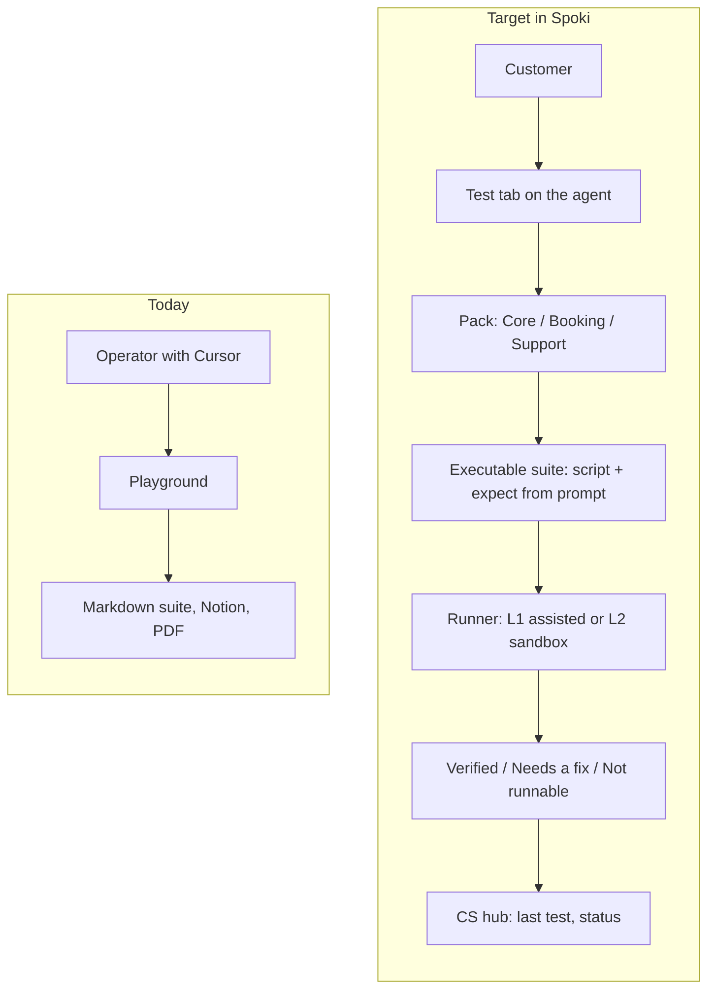
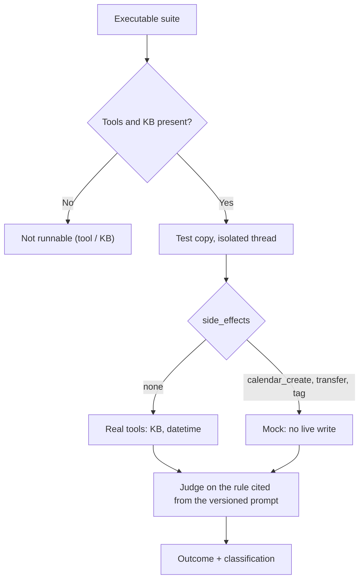

# Spoki agent testing — product handoff

**From:** Post Sales / AI prompt testing
**Date:** 4 September 2026
**Subject:** Make agent testing accessible to the customer inside Spoki
**Full product spec:** [product/spoki-agent-test.md](file:///Users/giulio/Desktop/AI-churn-analysis/.cursor/skills/spoki-prompt-test/product/spoki-agent-test.md)
**Italian original:** [Spoki-prodotto-test-agente-handoff.md](file:///Users/giulio/Desktop/AI-churn-analysis/clients-prompt/_exports/Spoki-prodotto-test-agente-handoff.md)

---

## The problem in one sentence

Today only an operator with Cursor can validate an agent against its own system prompt. We need a **Test** tab on the agent page in Spoki so the customer (and CS in impersonate) can run scenarios, see outcomes in plain language, and know the next step — without git, Notion, or Langfuse.

## Why now

Each agent costs a turn-by-turn session: one message, wait, score, update a file. Seventeen suites were produced this way (Casp CUP, Mario AI Operator, LetsMove, Boldrin, Dreaming Sicily, Calatafimi, Dimann, AVS Ultra, and others). The process works. It does not scale past a single operator, and the customer sees nothing in the product.

## Quality contract (do not drop)

These three rules make manual testing trustworthy. Replicate them in the product or the Test tab will produce false greens and false alarms.

| Rule | UI consequence |
| --- | --- |
| Score **only the agent’s actual prompt** | If a rule is not in the prompt, that scenario does not appear and cannot fail |
| Missing tool or knowledge base → **not runnable**, not “needs a prompt fix” | Skip is visible and classified (tool / KB / platform) |
| Side-effect scenarios never hit production | Calendar create, contact tags, and transfer run on a test copy with mocks |

---

## Knowledge base: ingestion, not “upload anything”

Fixing the knowledge base is often what unblocks FAQ / P0 tests, not a prompt tweak. Scraping one or more URLs and uploading PDFs is **not** quality ingestion: they arrive full of menus, cookie banners, and XML/layout tags, and the assistant can quote them. Reliable formats are **structured text** (author in markdown; Spoki today accepts `.txt`, not `.md`) and **CSV** for tables (price lists, shifts, catalogues).

Default on the agent: **one** operational facts file (easier to debug). Extra files only for price-list CSVs or a platform character cap — not one PDF per page. Scrape and PDF stay an entry door: rewrite them; do not attach them as-is.

Do not ask product for an XML/PDF cleaner in the first Test tab. Ask for a clear warning plus guidance to text/CSV. A later “clean and unify” flow is optional engineering.

Customer copy (KB screen or Test next step), Italian product:

> Carica testi e tabelle puliti (file di testo o CSV). Lo scrape del sito e i PDF spesso includono menu e codice: l’assistente può citarli.

English equivalent:

> Upload clean text and tables (plain-text or CSV files). Site scrapes and PDFs often include menus and markup; the assistant may quote them.

---

## Langfuse evidence — retrieval over PDFs (AVS Ultra / Raptor)

Observed in playground on 4 September 2026, text agent Alex AVS Assistant. This is not a hypothesis: it is the I/O of the `search_knowledge_base` span. The tool succeeds; the query is on-topic; the top-k hits are PDF-extracted text (covers, datasheets, duplicates, tags). That is not a prompt fail.

**Trace (tool observation):** [Langfuse — search_knowledge_base](https://langfuse.ai.spoki.com/project/cmmxdg3y70004oa073ytjt9md/traces?search=7f207435-7842-4edb-906e-e03faa978d91&searchType=id&searchType=content&peek=7f76973faa67906849824f99553104fb&timestamp=2026-09-04T14%3A03%3A41.818Z&observation=deb970facee18ad5)

| Field | Value |
| --- | --- |
| Project | ai-production |
| Agent id | `7f207435-7842-4edb-906e-e03faa978d91` |
| Trace peek | `7f76973faa67906849824f99553104fb` |
| Observation | `deb970facee18ad5` |
| Tool | `search_knowledge_base` |
| Status | `success` |
| Tool call id | `ca47b30b-1a75-432c-a8ad-c9453a098831` |

**User input (WhatsApp / playground)** — verbatim Italian, as typed

Come posso gestire le temperature con centrale Raptor?

*(“How do I manage temperatures with a Raptor panel?”)*

**Tool input (`query`)** — verbatim, as the agent built it

gestione temperature centrale RAPTOR software XWIN funzione termostato

*(“temperature management RAPTOR panel XWIN software thermostat function”)*

How to read the 10 chunks (full text in the appendix; original Italian, as indexed):

| # | source_id (prefix) | What it is | Why it is noise or misleading |
| --- | --- | --- | --- |
| 1 | `fd8fa10b-…` | Raptor datasheet (125 devices, Xwin, voltages) | Commercial listing; ends with `</DOCUMENT>` |
| 2 | `fd8fa10b-…` | “Abil. sens. temp” menu (threshold, offset, hysteresis) | Only near-hit; it is a **sensor alarm**, not the Economy/Comfort thermostat procedure |
| 3 | `f3514c4c-…` | Xwin PDF cover | `I T A`, ISO9001, table of contents — page layout |
| 4–7 | `b150222b-…` | Repeated datasheets (different models) | “Temperatura -10 / +55 °C” is the panel **operating** range, not climate control; duplicates |
| 8 | `fd8fa10b-…` | More Raptor datasheet (keypads, zones, radio) | Same PDF, different slice |
| 9–10 | `f3514c4c-…` | Xwin TOC + install | PDF leader dots (`DESCRIZIONE ..... 3`), Windows 95, CD-ROM |

Three conclusions for engineering, with no other backend access required:

1. The tool span is the I/O contract to capture in L2 (query in; `content[].text` + `source_id` out).
2. Indexing the PDF as-is makes “temperatura” collide with the environmental range and the Xwin table of contents.
3. A clean facts markdown already exists (Ultra manual, thermostat section: Economy / Normal / Comfort). If PDFs stay on the agent, the model sees the TOC, not that section.

What this is not: a bug in `search_knowledge_base` (it returned the attached documents). It is ingest.

Byte-for-byte copy of the span: [Spoki-prodotto-test-agente-handoff-langfuse-kb.json](file:///Users/giulio/Desktop/AI-churn-analysis/clients-prompt/_exports/Spoki-prodotto-test-agente-handoff-langfuse-kb.json)

---

## What to build

### L1 — Test tab next to playground (UI MVP)

The customer picks a pack, fills a few variables, runs, and marks the outcome.

- Packs: **Core** for every agent; **Booking** if the prompt uses a calendar; **Support** if it is FAQ, tickets, or a manual.
- Variables: greeting, “speak to an operator”, fake name, a question covered by the knowledge base.
- Customer outcomes: **Verified** / **Needs a fix** / **Not runnable** (Italian UI: Verificato / Da correggere / Non eseguibile).
- Per scenario: transcript, the prompt rule in one sentence, next step (“update the knowledge base: clean text or CSV, one facts file”, “connect tool X”, “the prompt contradicts the tool”).
- Keep off the customer UI: internal IDs (`H1`, `Pass*`), Notion paths, Langfuse.

### L2 — Sandbox runner (this removes copy-paste)

An API that opens an isolated conversation on a **test copy**, sends the scripts, captures the reply and tool calls, then clears the thread.

- Side-effect tools mocked: `create_event` must not write the live calendar; transfer and tag must not touch CRM or human queues.
- If a declared tool or the knowledge base is missing: automatic skip, do not call the model.
- Auto-play the Booking pack **only after** calendar mock exists.

### L3 — Judge, regression, CS webhook

- The judge receives **only** the rule cited from the prompt version stored on that run. No global Spoki rubric (emoji, tu/Lei, markdown) unless it is in the customer’s prompt.
- Re-run P0 scenarios when the system prompt is saved or the knowledge base is re-uploaded. Badge “last test” on the agent; amber if prompt or KB is newer than that run.
- Internal webhook to the CS hub: last-test date, status, counts.
- Auto-patch of the live system prompt: no. A draft suggestion at most.

---

## What not to do

- A separate “Eval” product on the first pass: it is a tab on the agent.
- Live execution of calendar-create or contact-tag scenarios.
- Fail on criteria absent from the customer’s prompt.
- Send the customer to Langfuse, Notion, or the git repo.
- Treat raw URL scrapes and PDFs as a ready knowledge base: they are noise to rewrite.
- Promise an automatic XML/PDF cleaner in the MVP UI.

## Why Langfuse stays off the customer UI

Langfuse is the internal tool for traces and tool payloads: a separate login, dedicated projects, sometimes personal data in the clear. The runner can and should keep tracing. The URL does not belong on the Test tab: the customer needs the outcome and the next step. CS additionally sees run id, classification, and the test-copy link; engineering has the trace.

---

## Data contract (already drafted)

An executable JSON/YAML suite on the agent, beside the human-readable suite. Main fields:

- `script` — user turns to send
- `expect` — rule cited from the prompt under test, plus a customer-facing label
- `tools_required`, `kb_required`
- `side_effects` — `none`, `calendar_create`, `transfer`, `tag`
- `classify_on_fail` — `prompt`, `kb`, `tool`, `platform`
- `prompt.version_id` — prompt version used for that run

### Artifacts for product

| What | Where |
| --- | --- |
| L1–L3 product spec | [spoki-agent-test.md](file:///Users/giulio/Desktop/AI-churn-analysis/.cursor/skills/spoki-prompt-test/product/spoki-agent-test.md) |
| Suite JSON Schema | [agent-test-suite.schema.json](file:///Users/giulio/Desktop/AI-churn-analysis/.cursor/skills/spoki-prompt-test/schema/agent-test-suite.schema.json) |
| Core pack | [core.yaml](file:///Users/giulio/Desktop/AI-churn-analysis/.cursor/skills/spoki-prompt-test/packs/core.yaml) |
| Booking pack | [booking.yaml](file:///Users/giulio/Desktop/AI-churn-analysis/.cursor/skills/spoki-prompt-test/packs/booking.yaml) |
| Support pack | [support.yaml](file:///Users/giulio/Desktop/AI-churn-analysis/.cursor/skills/spoki-prompt-test/packs/support.yaml) |
| Core + Booking example (Casp 53298) | [53298-centro-unico-prenotazioni-suite.yaml](file:///Users/giulio/Desktop/AI-churn-analysis/clients-prompt/53298-centro-unico-prenotazioni-suite.yaml) |
| Core + Support example (Mario 1384) | [1384-mario-ai-operator-suite.yaml](file:///Users/giulio/Desktop/AI-churn-analysis/clients-prompt/1384-mario-ai-operator-suite.yaml) |
| Current internal process (skill) | [SKILL.md](file:///Users/giulio/Desktop/AI-churn-analysis/.cursor/skills/spoki-prompt-test/SKILL.md) |

### Notion

- [Customer text and voice agents](https://app.notion.com/p/3b9e5c7af25c80fd8705f8561a2eed09) — hub (agent rows, documents, changelog)
- [Playbook — AI prompt testing](https://app.notion.com/p/3c0e5c7af25c8146909cd57cc9e5bd8c) — how the team runs a suite today
- [Install — Spoki prompt test (Cursor)](https://app.notion.com/p/3c0e5c7af25c816bb377d37ef43c177e) — install page under the agents hub
- [Install — Spoki prompt test (Post Sales)](https://app.notion.com/p/3cfe5c7af25c81ceacacc5a4ec9fe8c8) — twin page, same attachments

---

## Suggested pilot

Three agents, before automation, to validate copy and skip classification:

1. a CUP booking agent on a test copy (Core + Booking, with calendar mock);
2. a support agent like Mario (Core + Support);
3. an FAQ case with no calendar, like LetsMove (Core + Support).

## Standup line

Test tab on the agent, same quality contract as internal prompt testing: P0 first, no invented rules, visible skips for tools and knowledge base, sandbox mocks before enabling booking.

---

# Appendix — full search_knowledge_base I/O

Copy of the Langfuse span (observation `deb970facee18ad5`). No personal data in the payload. Chunk text is the original Italian as returned by retrieval.

Tool input query: gestione temperature centrale RAPTOR software XWIN funzione termostato

Envelope: `type: tool`, `name: search_knowledge_base`, `status: success`, empty `additional_kwargs` / `response_metadata`, `id` and `artifact` null.

### Full text of the 10 chunks (as in Langfuse)

**Chunk 1** — `fd8fa10b-b5f5-4eb0-bc29-f0eb0270d031`

<pre>- **n° 125** dispositivi disponibili **(con più di mille miliardi di combinazioni)**
- **n° 125** dispositivi di **Emergenza** disponibili &lt;u&gt;(con più di mille miliardi di combinazioni)&lt;/u&gt;
- **n° 125** dispositivi disponibili **(con più di mille miliardi di combinazioni)**
- **n° 125** dispositivi di **Emergenza** disponibili &lt;u&gt;(con più di mille miliardi di combinazioni)&lt;/u&gt;
- **16** operazioni giornaliere per tutti i settori
- accensioni spegnimenti di settori, attivazione OC, attivazione Scenari e blocco Codici Utente
- funzione “copia da lunedì a venerdì” e “copia da lunedì a domenica”
- **10** periodi festivi programmabili
- cambio automatico ora solare-legale e legale-solare
- durata Avviso Inserimento / gestione Straordinario
- inibizione dei codici a PO acceso
- n°**16** numeri telefonici su linea PSTN/GSM
- n°**40** messaggi vocali personalizzabili oltre ad una estesa libreria di vocaboli
- combinatore telefonico GSM (XGSM 485) opzionale
- segnalazione su display delle anomalie di funzionamento centrale o alimentatore supplementare supervisionato
- da tastiera a display con menù guidati facilitati
- da PC in connessione diretta con software **Xwin e** cavo USB
- da PC in connessione di rete con software **Xwin**
- da PC in connessione tramite CLOUD con software **Xwin**
- da APP in connessione tramite CLOUD
- tensione stabilizzata nominale di alimentazione Raptor R-R 4G e RK-RK 4G: 14,2 V =
- tensione stabilizzata nominale di alimentazione Raptor RT-RT 4G: 24 V =
- 70 mA / 230 V ~ (16 W)
Telefonico
&lt;/DOCUMENT&gt;</pre>

**Chunk 2** — `fd8fa10b-b5f5-4eb0-bc29-f0eb0270d031`

<pre>|Abil. sens. temp.|NO|Abilita allarme temperatura (SI/NO): Se abilitato, il sensore invia allarme zona al superamento verso su o verso giù di una soglia di temperatura programmabile Bassa temperatura (SI/NO): Se abilitato, il sensore va in allarme quando la temperatura scende sotto la soglia programmata (allarme freddo). Altrimenti, l’allarme si produce quando la temperatura supera tale soglia (allarme calore) Offset temperatura: Correzione del valore di temperatura misurato dal sensore in multipli di 0,1°C. Può assumere un valore compreso tra -3,1 e +3,1°C-valori da 0 a 31 – corrispondono a valori positivi da 0.0° a 3.1° - valori da 101 a 131 – corrispondono a valori negativi da -0.1° a -3.1° Soglia temperatura: Valore compreso tra -99 e +99°C che rappresenta la soglia di allarme temperatura. Il sensore introduce autonomamente una isteresi di 1,0°C per il ripristino allarme-valori da 0 a 99 – corrispondono a valori positivi da 0° a 99° - valori da 101 a 199 – corrispondono a valori negativi da -1° a -99° Cancellaz. sens. (cancellazione sensori dalla memoria centrale): entrando in questo menù si ha la possibilità di cancellare singolarmente i vari sensori acquisiti. NOTA: se si vuole svincolare il sensore dalla centrale per poterlo riutilizzare in un altro impianto, è necessario eseguire la seguente procedura per cancellare il codice centrale memorizzato: • togliere e reinserire la batteria del sensore • nei primi 10 secondi premere 3 volte in rapida sequenza il pulsante del TAMPER • se l’operazione viene accettata, il led si accenderà di luce fissa per qualche secondo ATTENZIONE: E’ consigliato acquisire la programmazione nel software XWIN poichè, nel caso di sostituzione della scheda centrale, basterà far acquisire alla nuova centrale la programmazione salvata per poter recuperare il codice della centrale rimossa e l’abbinamento di tutti i sensori radio esistenti. In caso contrario si renderà necessario eseguire la manovra di cancellazione nei singoli sensori come descritto in precedenza Cancella tutti (cancellazione simultanea di tutti i sensori): entrando in questo menù si ha la possibilità di cancellare contemporaneamente tutti i sensori acquisiti. A cancellazione avvenuta, il display visualizza “eseguito”. Verifica sensori: in questo menù si verifica quali sensori sono acquisiti e le loro caratteristiche. Lista sensori: i sensori acquisiti sono evidenziati con un (s) Test sensori: verifica quale sensore ha trasmesso e visualizza le sue
&lt;/DOCUMENT&gt;</pre>

**Chunk 3** — `f3514c4c-03c7-48b0-a862-e02ef73ac953`

<pre>Curtarolo (Padova) Italy www.avselectronics.com

**I T** **A**

# Xwin

**E N**

### SOFTWARE DI PROGRAMMAZIONE G CENTRALI SERIE

## Xtream-Raptor

Sistema di Qualità certificato **ISO9001:2008** Ist0793v9.1

## Sommario
&lt;/DOCUMENT&gt;</pre>

**Chunk 4** — `b150222b-a544-47f8-8152-b332d9b40089`

<pre>- accensioni spegnimenti di settori e attivazione OC
- funzione “copia da lunedì a venerdì” e “copia da lunedì a domenica”
- 20 periodi festivi programmabili
- cambio automatico ora solare-legale e legale-solare
- durata Avviso Inserimento / gestione Straordinario
- inibizione dei codici a PO acceso
- n°16 numeri telefonici su linea PSTN/GSM
- n°40 messaggi vocali personalizzabili oltre ad una estesa libreria di vocabolI con scheda
- opzionale mod. **XSINT** combinatore telefonico GSM (mod. Xgsm) opzionale
- &lt;u&gt;segnalazione su display delle anomalie di funzionamento centrale&lt;/u&gt;
- da tastiera a display con menù guidati facilitati
- da PC in connessione diretta con software **Xwin e** cavo USB
- &lt;u&gt;da PC in connessione telefonica con software Xwin e modem universale&lt;/u&gt;
- tensione stabilizzata nominale di alimentazione: 13.8 V =
- tastiera ICE: 129,5 x 92 x 15,5 mm
- tastiera A600 - A600 Plus-A600 EVO-A600 EVO Plus: (LxHxP) 153 x 120 x 35 mm
- tastiera A500 - A500 Plus: (LxHxP) 135 x 114 x 35 mm
- tastiera A300 - A300 Plus (LxHxP): 120 x 90 x 15 mm
- contenitore (LxHxP): 330 x 420 x 107 mm
- Temperatura -10 °C / + 55 °C -Umidità 95%
- Class II 5 Kg
- 0.8A / 230 V ~ +10% -15% 50 Hz
- &lt;u&gt;solo scheda centrale 250 mA con combinatore telefonico PSTN attivato&lt;/u&gt;
- 18Ah
- **EN 50131- 1 Grado 2 • EN50136-2**
- **EN 50131- 3 Grado 2**
- **EN 50131- 6 Grado 2**
Telefonico
&lt;/DOCUMENT&gt;</pre>

**Chunk 5** — `b150222b-a544-47f8-8152-b332d9b40089`

<pre>- 32 operazioni giornaliere per tutti i settori
- accensioni spegnimenti di settori e attivazione OC
- funzione “copia da lunedì a venerdì” e “copia da lunedì a domenica”
- 20 periodi festivi programmabili
- cambio automatico ora solare-legale e legale-solare
- durata Avviso Inserimento / gestione Straordinario
- inibizione dei codici a PO acceso
- n°16 numeri telefonici su linea PSTN/GSM
- n°40 messaggi vocali personalizzabili oltre ad una estesa libreria di vocaboli con scheda vocale opzionale mod. **XSINT**
- combinatore telefonico GSM (mod. **Xgsm**) opzionale
- segnalazione su display delle anomalie di funzionamento centrale o alimentatori supple- mentari supervisionati (mod.**POWER1Q, POWER4Q, POWER3 e POWER5**)
- da tastiera a display con menù guidati facilitati
- da PC in connessione diretta con software **Xwin e** cavo USB
- da PC in connessione telefonica con software **Xwin** e modem universale
- tensione stabilizzata nominale di alimentazione: 13.8 V =
- tastiera ICE: 129,5 x 92 x 15,5 mm
- tastiera A600 - A600 Plus-A600 EVO-A600 EVO Plus: (LxHxP) 153 x 120 x 35 mm
- tastiera A500 - A500 Plus: (LxHxP) 135 x 114 x 35 mm
- tastiera A300 - A300 Plus (LxHxP): 120 x 90 x 15 mm
- contenitore (LxHxP): 275 x 275 x 99.5 mm
- Temperatura -10 °C / + 55 °C -Umidità 95%
- 0.4A / 230 V ~ +10% -15% 50 Hz
- solo scheda centrale 250 mA con combinatore telefonico PSTN attivato
- massimo 7Ah
- 10 -
Corrente max. assorbita su 13.8 V =
&lt;/DOCUMENT&gt;</pre>

**Chunk 6** — `b150222b-a544-47f8-8152-b332d9b40089`

<pre>- accensioni spegnimenti di settori e attivazione OC
- funzione “copia da lunedì a venerdì” e “copia da lunedì a domenica”
- 20 periodi festivi programmabili
- cambio automatico ora solare-legale e legale-solare
- durata Avviso Inserimento / gestione Straordinario
- inibizione dei codici a PO acceso
- n°16 numeri telefonici su linea PSTN/GSM
- n°40 messaggi vocali personalizzabili oltre ad una estesa libreria di vocabolI con scheda
- opzionale mod. **XSINT** combinatore telefonico GSM (mod. Xgsm) opzionale
- segnalazione su display delle anomalie di funzionamento centrale
- da tastiera a display con menù guidati facilitati
- da PC in connessione diretta con software **Xwin e** cavo USB
- da PC in connessione telefonica con software **Xwin** e modem universale
- tensione stabilizzata nominale di alimentazione: 13.8 V =
- tastiera ICE: 129,5 x 92 x 15,5 mm
- tastiera A600 - A600 Plus-A600 EVO-A600 EVO Plus: (LxHxP) 153 x 120 x 35 mm
- tastiera A500 - A500 Plus: (LxHxP) 135 x 114 x 35 mm
- tastiera A300 - A300 Plus (LxHxP): 120 x 90 x 15 mm
- contenitore (LxHxP): 275 x 275 x 99.5 mm
- Temperatura -10 °C / + 55 °C -Umidità 95%
- 0.25A / 230 V ~ +10% -15% 50 Hz
- solo scheda centrale 250 mA con combinatore telefonico PSTN attivato
- massimo 7Ah
- 12 -
Corrente max. assorbita su 13.8 V =
&lt;/DOCUMENT&gt;</pre>

**Chunk 7** — `b150222b-a544-47f8-8152-b332d9b40089`

<pre>- 20 periodi festivi programmabili
- cambio automatico ora solare-legale e legale-solare
- durata Avviso Inserimento / gestione Straordinario
- inibizione dei codici a PO acceso
- n°64 numeri telefonici su linea PSTN/GSM
- n°40 messaggi vocali personalizzabili oltre ad una estesa libreria di vocaboli
- combinatore telefonico GSM (mod. Xgsm) opzionale
- segnalazione su display delle anomalie di funzionamento centrale o alimentatori sup- plementari supervisionati
- da tastiera a display con menù guidati facilitati
- da PC in connessione diretta con software **Xwin e** cavo USB
- &lt;u&gt;da PC in connessione telefonica con software Xwin e modem universale&lt;/u&gt;
- tensione stabilizzata nominale di alimentazione: 13.8 V =
- tastiera ICE: 129,5 x 92 x 15,5 mm
- tastiera A600 - A600 Plus-A600 EVO-A600 EVO Plus: (LxHxP) 153 x 120 x 35 mm
- tastiera A500 - A500 Plus: (LxHxP) 135 x 114 x 35 mm
- tastiera A300 - A300 Plus (LxHxP): 120 x 90 x 15 mm
- contenitore (LxHxP): 330 x 420 x107 mm
- Temperatura -10 °C / + 55 °C -Umidità 95%
- Class II
- 5 Kg
- 0.8A / 230 V ~ +10% -15% 50 Hz
- &lt;u&gt;solo scheda centrale 250 mA con combinatore telefonico PSTN attivato&lt;/u&gt;
- 18Ah
- **EN 50131- 1 Grado 3** • **EN50136-2**
- **EN 50131- 3 Grado 3**
- **EN 50131- 6 Grado 3**
Telefonico
&lt;/DOCUMENT&gt;</pre>

**Chunk 8** — `fd8fa10b-b5f5-4eb0-bc29-f0eb0270d031`

<pre>- **Raptor RK-Raptor RK 4G:** tastiera con tasti siliconici e display a 16 caratteri su 2 righe integrata in centrale
- **Raptor R-Raptor R 4G:** senza tastiera integrata in centrale
- **per tutti i modelli massimo n° 7 tastiere aggiuntive** &lt;u&gt;su 600 metri complessivi di cavo a 4 conduttori&lt;/u&gt;
- massimo n° 2
- massimo n° 8
- **n° 1** su 600 metri complessivi di cavo a 4 conduttori, programmabile come ingresso e/o uscita
- **n° 8** (settori separati)
- n° **125**, programmabili con rilevazione automatica dello stato di allarme e di antimanomissione, gestibile singo- larmente.
- **n° 3** espandibili ( **L1, L2, T/L3**&lt;u&gt;). Non conformi alle Norme EN50131&lt;/u&gt;
- n° **125** con sistema radio bidirezionale GFSK FM 868 Mhz. Cambio automatico della frequenza (AFC), riduzione automatica della potenza (ALP), gestione dinamica delle trasmissioni (DPT), impostazioni sensori a distanza (RDS).
- Istantanea, Condizionata, Istantanea con esclusione permanente, Istantanea con esclusione temporanea, Tem- porizzata 1, Temporizzata con esclusione temporanea 1, Temporizzata con esclusione permanente 1, Accensione ON, HOME, AREA, PERIMETRO, 24 ore, 24 ore temporizzata 1, Tamper, Fuoco, Guasto Primario, Guasto Secondario, AntiMask, Rapina, Non usata
- Impulsi, memoria allarme e ripristino, collegamento N.C., collegamento N.A., bilanciata con 1 resistenza, bilanciata con 2 resistenze (segnala tamper), funzione chime, door, zone in test, buzzer in allarme, attiva uscite O.C., AND zone e AND direzionale, gestione sopravvivenza radio, stringa alfanumerica di 16 caratteri, codifica allarmi, inerziale vibrazione, inerziale tapparella.
- **n° 500** eventi memorizzabili con data e ora ed esito delle telefonate
- **n° 1** relè di allarme programmabile a due vie ed a sicurezza positiva. A queste uscite collegare solamente circuiti operanti con tensioni SELV.
- **n° 2** uscite transistorizzate (Open Collector) su morsettiere per il collegamento con scheda a relè a richiesta. Con- figurabili in varie modalità.
- **n° 4** modalità di accensione automatica
- Da tastiera a display o da attivazioni esterne in modalit&lt;u&gt;à ON, HOME, AREA e PERIMETRO&lt;/u&gt;
- **n° 125** codici utente disponibili da 4 a 6 cifre **(con più di 1.000.000 di combinazioni)**
- **n° 8** profili utente programmabili
- **n° 125** codici di **Emergenza** automatici **(con più di 1.000.000 di combinazioni)**
- **n° 125** dispositivi disponibili **(con più di mille miliardi di combinazioni)**
&lt;/DOCUMENT&gt;</pre>

**Chunk 9** — `f3514c4c-03c7-48b0-a862-e02ef73ac953`

<pre>DESCRIZIONE .................................................................................................................... 3
REQUISITI DEL SISTEMA .................................................................................................. 3
INSTALLAZIONE COME AMMINISTRATORE .................................................................... 4
INSTALLAZIONE CON OPZIONE DI SINCRONIZZAZIONE TRA PC ................................ 5
SCHERMATA INIZIALE ....................................................................................................... 6
OPZIONI PROGRAMMA ..................................................................................................... 6
AGGIORNA TRAMITE FILE ZIP .......................................................................................... 6
AGGIORNA TRAMITE INTERNET ...................................................................................... 6
GESTIONE CONNESSIONI ................................................................................................ 7
ANAGRAFICA CENTRALI ................................................................................................... 7
FUNZIONI XWIN ................................................................................................................. 8
TRASFERIMENTO PROGRAMMAZIONE / CONNESSIONE ............................................. 9
Connessione con Xtream 640 (con versione scheda master precedente a MA00512) ....... 9
Connessione con Xtream 64-32-6 Xtream640 (da versione scheda master MA00512) ...... 9
QUICK COMAND (Scorciatoie di programmazione) .......................................................... 10
COPIA PROGRAMMAZIONE – MODALITA’ GRIGLIA ..................................................... 10
COPIA ................................................................................................................ 11
MODALITA’ GRIGLIA ............................................................................................. 11
ATTIVARE LE PROGRAMMAZIONI.................................................................................. 12
Codice di Comunicazione .................................................................................................. 12
Account di Telegestione..................................................................................................... 12
CREAZIONE FONIE PERSONALIZZATE ......................................................................... 13
&lt;/DOCUMENT&gt;</pre>

**Chunk 10** — `f3514c4c-03c7-48b0-a862-e02ef73ac953`

<pre>## &lt;u&gt;DESCRIZIONE&lt;/u&gt;

XWIN è il software avanzato per la completa programmazione della centrale Xtream sia in connessione diretta utilizzando un cavo USB, sia in remoto con un modem universale a 56K, sfruttando il canale GSM, TCP/IP o la connessione CLOUD. XWIN permette l’aggiornamento firmware centrale con connessione diretta in centrale tramite porta USB- TCP/IP-CLOUD a seconda delle caratteristiche della centrale collegata. Il software ha poi la possibilità di visionare in tempo reale lo stato del sistema dando indi- cazione dei consumi istantanei della centrale e lo stato delle varie apparecchiature. Oltre a questo è possibile avere il controllo completo dello stato degli ingressi, delle uscite utente ed è anche possibile intervenire, in locale o remoto, accendendo/spegnendo il sistema. Tutte le operazioni sono subordinate all’inserimento di un codice Utente abilitato. La modalità REAL TIME è la nuova telegestione dinamica di AVS che permette di monito- rare e gestire a 360° ogni singolo impianto.

## &lt;u&gt;REQUISITI DEL SISTEMA&lt;/u&gt;

- Windows 95B - 98E - 2000SP3 – ME-XP SP1 – VISTA – 7- 8 - 10**I**
- Compatibilità modem: Modem standard V.90
**T**

- Compatibilità centrale: XTREAM / RAPTOR
**A**

## &lt;u&gt;INSTALLAZIONE COME AMMINISTRATORE&lt;/u&gt;

L’installazione semplificata del prodotto prevede un CD-ROM autoinstallante.

Una volta avviata la procedura, viene proposta all’utilizzatore di procedere come AMMINI- STRATORE o UTENTE.

## Selezionare “AMMINISTRATORE”.

A questo punto è necessario impostare una password che servirà a proteggere il software. Impostare anche il campo “Nome”. Se sarà necessario cambiare la lingua (default Italiano), si potrà selezionare tra inglese, francese. Per completare la procedura premere “OK”

## &lt;u&gt;INSTALLAZIONE CON OPZIONE DI SINCRONIZZAZIONE TRA PC&lt;/u&gt;

Ci sono due strade per garantire la sincronizzazione tra più pc in cui è installato XWin. Entrambe richiedono che ci sia un solo pc con XWin installato come amministratore e tutti gli altri come Utente. L'installazione amministratore fa modo da master, mentre tutte le altre da slave.

## 1^ soluzione VIA chiavetta USB
&lt;/DOCUMENT&gt;</pre>
