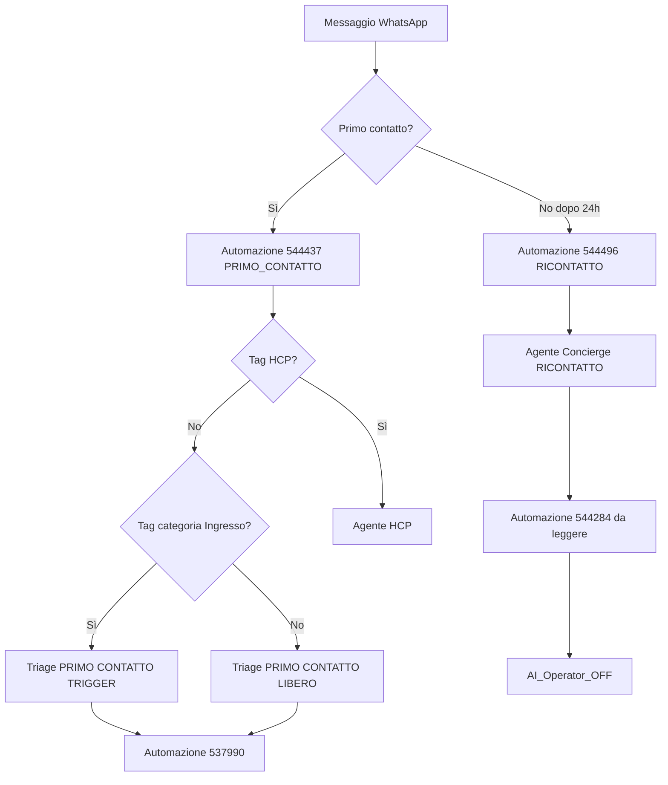

# Dimann — Piano operativo (Spoki `47493`)

**Deliverable executive:** [`47493-dimann-proposta-executive.html`](47493-dimann-proposta-executive.html)  
**Guida automazioni (HTML):** [`47493-dimann-automazioni-spiegazione.html`](47493-dimann-automazioni-spiegazione.html)

Copie in `~/Downloads/` con gli stessi nomi.

*Questo file è la checklist interna di implementazione.*

L'agente **raccoglie informazioni** e le passa alle guide Dimann. **Non** consiglia su prodotti, sintomi o posologia.

Fonti: [`AGENTI AI - SPOKI DIMANN.docx`](../../AGENTI%20AI%20-%20SPOKI%20DIMANN.docx) · Account **47493** · Agenti **Custom** (non Customer)

---

## Cosa fare ora

### Tu (Spoki / setup) — in questo ordine

| # | Azione | Dove | Fatto? |
| --- | --- | --- | --- |
| 1 | Creare i **tag** (tabella sotto) | Spoki → Contatti → Tag | ☐ |
| 2 | Verificare automazione **537990** (recap + da leggere) | Spoki → Automazioni | ☐ |
| 3 | Capire se **544284** serve ancora o è ridondante | Stesso posto | ☐ |
| 4 | Creare **automazione ingresso** (diagramma sotto) | Spoki → Automazioni | ☐ |
| 5 | Creare **4 agenti Custom** (Triage Trigger, Triage Libero, Concierge, HCP) | Spoki → Agenti AI | ☐ |
| 6 | Collegare **537990** a fine Triage; **544284** a fine Concierge | Automazioni / webhook agente | ☐ |

### Dimann (cliente) — da chiedere prima dei prompt

| # | Cosa serve | Perché |
| --- | --- | --- |
| A | **KB triage**: 10 domande, ordine, logica ramificata | Agente triage |
| B | **Valori tag** INTENT e FASE | Tag + automazioni |
| C | **Testo dei 4 casi particolari** (rifiuto AI, red flags, caregiver, uomo) | Sezioni prompt |
| D | Conferma deprecazione **544284** | Evitare doppi trigger |

### Dopo A + B + C

| # | Azione | File repo |
| --- | --- | --- |
| 7 | Prompt HCP | [`47493 - Agente HCP.md`](47493%20-%20Agente%20HCP.md) |
| 8 | Prompt triage Trigger | [`47493 - Triage AI (Primo contatto - Trigger).md`](47493%20-%20Triage%20AI%20(Primo%20contatto%20-%20Trigger).md) |
| 9 | Prompt Concierge (ricontatto) | [`47493 - Agente Concierge (Ricontatto).md`](47493%20-%20Agente%20Concierge%20(Ricontatto).md) |
| 10 | Caricare KB triage | file in `clients-kb/47493-dimann-kb-*.md` |
| 11 | Test playground Triage / Concierge / HCP | [`47493-dimann-triage-test-suite.md`](47493-dimann-triage-test-suite.md), [`47493-dimann-concierge-test-suite.md`](47493-dimann-concierge-test-suite.md), [`47493-dimann-hcp-test-suite.md`](47493-dimann-hcp-test-suite.md) |

**Non scrivere i prompt finché mancano A, B e la KB triage.**

---

## Architettura (sintesi) — sistema aggiornato

| Agente | Quando interviene | Cosa fa | Fine |
| --- | --- | --- | --- |
| **HCP** | Tag HCP | Lei, tono formale. Se richiesta ricorrente (campioncini, consiglio paziente, informatore) → risposta da KB / form. Se trigger pulsante → menu opzioni. | Secondo prompt HCP |
| **Triage Trigger** | Primo contatto, no HCP, tag **Ingresso** | Flusso Caso 1 + 10 core + riepilogo + CONFERMO | **537990** |
| **Triage Libero** | Primo contatto, no HCP, **no** Ingresso | Legge messaggio, skip info già date, raccoglie resto, CONFERMO | **537990** |
| **Concierge** | Lista **RICONTATTO** (#544496, gate ≥24h) | Accoglie, prende atto, pazienza, non abbandono. **Nessun triage** | **544284** (Unread + AI OFF) |

**Regole fisse (in ogni prompt, in cima):**
- Mai posologia, prodotti, diagnosi, nomi di medici
- Mai "ti capisco" — plurale di team
- Nessuna tempistica precisa di risposta umana
- Trigger campagna → **pulsanti + tag**, non frasi da riconoscere in KB

---

## Tag e liste da verificare (Spoki 47493)

| Tag / lista | Quando |
| --- | --- |
| `PRIMO_CONTATTO` | Automazione **544437** (primissima volta) |
| Lista **RICONTATTO** | Automazione **544496** (≥24h; rimuove PRIMO_CONTATTO) |
| `hcp` / HCP | Professionista; anche recovery via step AI in 544437 |
| Ingresso (categoria) | Trigger non modificato → Triage Trigger |
| `intent_*` / `fase_*` | Tag da Triage (IDs 144750–753, 144748–749) |
| `trigger_*` | Opzionale: da quale pulsante campagna |

---

## Automazioni — scheda tecnica

Vedi [`47493-dimann-spoki-verifica.md`](47493-dimann-spoki-verifica.md) per checklist compilabile.

### Automazione 544437 — PRIMO CONTATTO

Tag `PRIMO_CONTATTO` + intercettazione HCP sfuggiti. Poi supervisore AI smista Trigger / Libero / HCP.

### Automazione 544496 — RICONTATTO

Dopo ≥24h dall’**ultimo messaggio/contatto** (non “contatto creato ieri”): rimuove `PRIMO_CONTATTO`, lista **Ricontatto**, **AI Operator ON** solo se il gate 24h passa.

**Fix SOS 21/07:** se l’operatrice ha già risposto e l’utente riscrive entro 24h, 544496 **non** deve riabilitare l’AI. La pausa su messaggio umano è default piattaforma; il bug era il Router che faceva `enable: true` di nuovo.

### Automazione 537990 — recap Triage

| | |
|---|---|
| **Trigger** | Fine flusso agenti Triage (action agente) |
| **Passi** | Riassunto / nota interna per Customer Care |
| **NON** | Usata dal Concierge |

### Automazione 544284 — chat da leggere

| | |
|---|---|
| **Trigger** | Fine flusso **Concierge** (e dove serve) |
| **Passi** | 1) Chat «da leggere» 2) **AI Operator OFF** (handoff umano) |
| **NON** | Sostituisce il recap clinico 537990 |

### Cosa fanno gli AGENTI (non le automazioni)

Triage 10 domande, riepilogo, conferma, messaggi HCP, accoglienza ricontatto Concierge, red flags, chiusura.

---

## Appendice — Test rapidi (dopo i prompt)

**Triage:** "Ciao" → inizia triage; "sì" a domanda triage ≠ conferma riepilogo; sangue nelle urine → red flag senza posologia; dopo "Il riepilogo è corretto?" + sì → 537990.

**HCP:** "Sono la Dott.ssa Rossi" → Lei, no 10 domande. **Ricontatto:** contatto in lista RICONTATTO → Concierge, no triage, 544284.

---

## Appendice — Decisioni già prese

- Agenti **Custom**, non Customer
- Quattro agenti: Triage Trigger, Triage Libero, **Concierge**, HCP
- Ricontatto = lista **RICONTATTO** (#544496), non (solo) tag `triage_completato`
- Concierge fine flusso = **544284**, non 537990
- **544284** deve spegnere l’Operatore AI (OFF) oltre a Unread — altrimenti l’AI riprende sul messaggio successivo
- **544496** gate = ≥24h ultimo messaggio/contatto, **non** solo `created_date`; AI ON solo su quel ramo
- Pausa AI su messaggio umano = default Spoki (nessuna automazione dedicata)
- Orari Concierge: messaggio neutro / pazienza, no tempistiche precise
- INTENT/FASE: mapping nel **prompt** Triage, assegnazione via action

Dettaglio requisiti: note cliente «NUOVO SISTEMA AUTOMAZIONI + AGENTI AI»; [`AGENTI AI - SPOKI DIMANN.docx`](../../AGENTI%20AI%20-%20SPOKI%20DIMANN.docx) (legacy).
