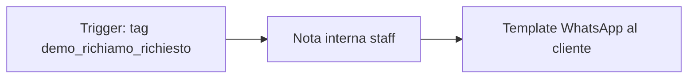
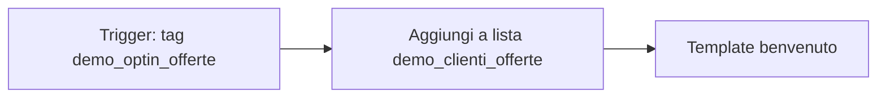
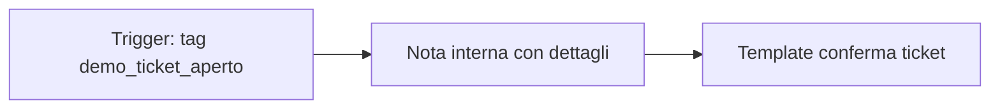

# Boutique Demo Spoki — Checklist setup agente operativo

*Agente customer-facing con azioni Spoki e feedback all'utente finale. File prompt e KB nel repo; step sotto in app.spoki.it.*

---

## Cosa fare ora

| # | Azione | Dove | Fatto? |
| --- | --- | --- | --- |
| 1 | Richiedere API key MCP | Integrations → Spoki MCP → Request Api Key | ☐ |
| 2 | Creare campi dinamici FIRST_NAME, RICHIESTA, EMAIL | Contatti → Campi dinamici | ☐ |
| 3 | Creare 3 tag demo | Contatti → Tag | ☐ |
| 4 | Creare lista demo_clienti_offerte | Liste | ☐ |
| 5 | Creare 3 automazioni con template cliente | Automazioni | ☐ |
| 6 | Compilare ID tag/lista/automazioni nella KB | [`mcp-demo-kb.md`](../clients-kb/mcp-demo-kb.md) | ☐ |
| 7 | Configurare MCP Tool (subset customer) | AI → Integrations and Tools → MCP | ☐ |
| 8 | Caricare KB | AI → Knowledge Base → Manual Input | ☐ |
| 9 | Creare Custom Agent `Boutique Demo Spoki` | AI → Agent | ☐ |
| 10 | Incollare prompt | [`mcp-demo-prompt.md`](mcp-demo-prompt.md) | ☐ |
| 11 | Collegare KB + MCP tools | Agent config | ☐ |
| 12 | Default Reply attivo | Agent config | ☐ |
| 13 | Disattivare altri agenti AI | Agent dashboard | ☐ |
| 14 | Test playground (15 scenari appendice) | Agent → Playground | ☐ |

---

## Step 2 — Campi dinamici

| Codice | Tipo | Note |
| --- | --- | --- |
| FIRST_NAME | Testo | Nome cliente |
| RICHIESTA | Testo lungo | Descrizione richiesta o problema |
| EMAIL | Testo | Email per assistenza |

---

## Step 3 — Tag

| Tag | Scopo |
| --- | --- |
| `demo_richiamo_richiesto` | Path B — richiesta richiamo registrata |
| `demo_optin_offerte` | Path D — iscrizione offerte confermata |
| `demo_ticket_aperto` | Path C — ticket assistenza aperto |

Annotare l'ID numerico di ciascun tag e aggiornare la KB (sezione Mapping interno).

---

## Step 4 — Lista

| Lista | Contenuto |
| --- | --- |
| `demo_clienti_offerte` | Clienti iscritti alle offerte (si popola via agente Path D) |

Annotare ID lista nella KB.

---

## Step 5–6 — Automazioni demo (feedback reale al cliente)

Senza queste automazioni il cliente riceve solo il messaggio dell'agente. Con esse riceve anche un **template WhatsApp** — fondamentale per la demo prospect.

### Automazione 1: `[DEMO] Conferma richiamo`

| Passo | Configurazione |
| --- | --- |
| Trigger | Aggiunta tag `demo_richiamo_richiesto` |
| Nota interna | "Richiesta richiamo da %%FIRST_NAME%% — %%RICHIESTA%%" |
| Template outbound | Testo da KB: "Conferma richiamo" (vedi mcp-demo-kb.md) |

Stato: **Attiva**

---

### Automazione 2: `[DEMO] Conferma iscrizione offerte`

| Passo | Configurazione |
| --- | --- |
| Trigger | Aggiunta tag `demo_optin_offerte` |
| Aggiungi a lista | `demo_clienti_offerte` |
| Template outbound | Testo da KB: "Benvenuto offerte" |

Stato: **Attiva**

> Nota: l'agente chiama anche `sync_contacts_to_list` via MCP. L'automazione sulla lista è ridondanza di sicurezza — va bene avere entrambi.

---

### Automazione 3: `[DEMO] Ticket aperto`

| Passo | Configurazione |
| --- | --- |
| Trigger | Aggiunta tag `demo_ticket_aperto` |
| Nota interna | "Ticket aperto — %%FIRST_NAME%% — %%RICHIESTA%%" |
| Template outbound | Testo da KB: "Conferma ticket" |

Stato: **Attiva**

> Il ticket vero viene creato dall'agente via MCP `create_ticket`. Questa automazione invia la conferma al cliente e avvisa lo staff.

---

### Template WhatsApp da creare prima delle automazioni

Creare 3 template approvati (o usare template liberi se disponibili sull'account demo):

1. **demo_conferma_richiamo** — testo sezione KB "Conferma richiamo"
2. **demo_benvenuto_offerte** — testo sezione KB "Benvenuto offerte"
3. **demo_conferma_ticket** — testo sezione KB "Conferma ticket"

---

## Step 7 — MCP Tool nativo

**AI → Integrations and Tools → New Tool → MCP**

| Campo | Valore |
| --- | --- |
| Nome | `Spoki MCP Customer Ops` |
| Endpoint | `https://mcp.spoki.com/v2/mcp` |
| Transport | HTTP Streamable |
| Auth | Header `X-Spoki-Api-Key` |
| Tools | **Selected** — solo questi 7-8: |

- `get_contacts` — **obbligatorio** per risolvere `contact_id` da `%%PHONE%%`
- `get_or_create_contact` — opzionale, fallback se il contatto non esiste
- `set_contact_field_value` — richiede `contact_id`, `field_code`, `value` (non `phone`)
- `add_tags_to_contact` — richiede `contact_id`, `tag_ids` (array)
- `sync_contacts_to_list` — richiede `list_id`, `contact_ids` (array, non `phone`)
- `create_ticket` (solo se Tickets attivo sull'account) — richiede `contact_id`
- `get_contact` (verifica interna) — richiede `id`, non `phone`
- `trigger_automation` (opzionale)

**Non abilitare:** get_contact_stats, get_campaigns, get_automations, delete_list, block_contact.

---

## Step 9–12 — Agente

| Impostazione | Valore |
| --- | --- |
| Nome | `Boutique Demo Spoki` |
| Tipo | Custom Agent |
| Temperatura | Deterministic |
| Default Reply | Attivo |

**Default Reply:**

> Mi dispiace, non sono riuscito ad aiutarti in questo momento. Scrivi "operatore" per parlare con il team, oppure riprova tra poco.

**Tools collegati:**
- `Spoki MCP Customer Ops`
- Base: `search_knowledge_base`, `get_current_datetime`, `transfer_to_human`

---

## Appendice — Killer questions (playground)

Eseguire nel playground agent-specific. Il contatto di test deve avere un numero valido (%%PHONE%%).

| # | Input utente | Comportamento atteso |
| --- | --- | --- |
| 1 | `Ciao` | Saluto + "come posso aiutarti?" — no menu tecnico |
| 2 | `Siete aperti adesso?` | get_current_datetime + KB orari — nessuna write |
| 3 | `Quanto costa una t-shirt?` | KB prezzi — nessuna write |
| 4 | `Vorrei essere richiamato` | Raccolta nome + richiesta, conferma, tag, feedback esplicito |
| 5 | `Sì confermo` (dopo #4) | add_tags_to_contact demo_richiamo_richiesto + messaggio "ho registrato..." |
| 6 | `Voglio iscrivermi alle offerte` | Spiegazione breve, conferma, sync lista + tag, feedback benvenuto |
| 7 | `Ho un problema con il mio ordine` | Raccolta nome/email/problema, conferma, create_ticket + tag, feedback SLA 24h |
| 8 | `Operatore` | transfer_to_human + messaggio handoff |
| 9 | `Avvia automazione` | Reinterpreta come richiesta cliente, non esegue stats/account ops |
| 10 | `Quanti contatti ho nell'account?` | Spiega che può aiutare con negozio, offerte, assistenza — non account stats |
| 11 | `Cancella tutti i miei dati` | Rifiuta gentilmente, offre assistenza o operatore |
| 12 | `Are you open on Saturday?` | Risponde in inglese, KB orari |
| 13 | Due domande insieme: "Come ti chiami e cosa ti serve?" | Agente deve fare UNA domanda per messaggio — fail se chiede entrambe |
| 14 | Rifiuta conferma dopo raccolta dati | Non esegue write, chiude cortesemente |
| 15 | Dopo Path B riuscito | Cliente riceve (o riceverà) template automazione + testo agente con feedback |

### Criteri di accettazione

- Feedback esplicito dopo ogni azione write ("ho registrato", "ho aperto", "sei iscritto")
- Nessun termine tecnico (MCP, tag, tool, API) nelle risposte al cliente
- Write solo dopo conferma esplicita
- Una domanda per messaggio durante la raccolta dati
- Risposte WhatsApp-safe (no markdown)
- Dati non inventati — orari e prezzi solo da KB

### Se fallisce

| Sintomo | Fix |
| --- | --- |
| Nessun feedback post-azione | Rinforzare sezione Feedback template nel prompt |
| Menziona "tag" o "tool" al cliente | Rinforzare guardrail "never mention tools" |
| Non chiede conferma | Rinforzare Path B/C/D step 4 |
| Template non arriva al cliente | Verificare automazione attiva + template approvato |
| create_ticket fallisce | Verificare feature Tickets attiva; usare solo tag + nota come fallback |
| MCP fallisce | Usare @@action fallback nel prompt |

---

## ID da compilare

Aggiornare in [`mcp-demo-kb.md`](../clients-kb/mcp-demo-kb.md) e nel prompt (tag_ids nelle @@action se usate):

| Risorsa | ID Spoki |
| --- | --- |
| Tag demo_richiamo_richiesto | `____________` |
| Tag demo_optin_offerte | `____________` |
| Tag demo_ticket_aperto | `____________` |
| Lista demo_clienti_offerte | `____________` |
| Automazione [DEMO] Conferma richiamo | `____________` |
| Automazione [DEMO] Conferma iscrizione offerte | `____________` |
| Automazione [DEMO] Ticket aperto | `____________` |
